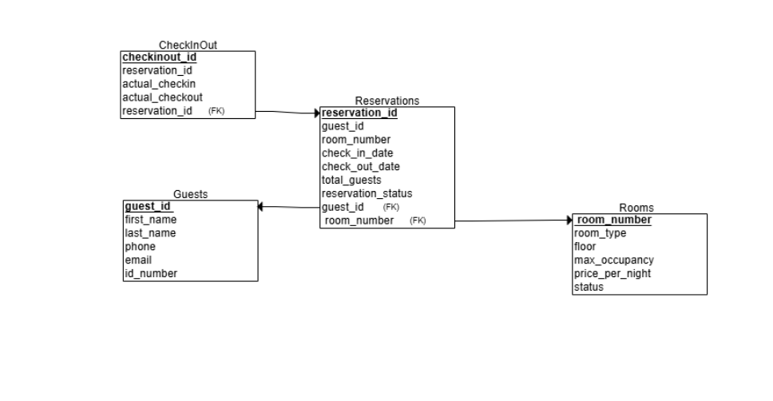
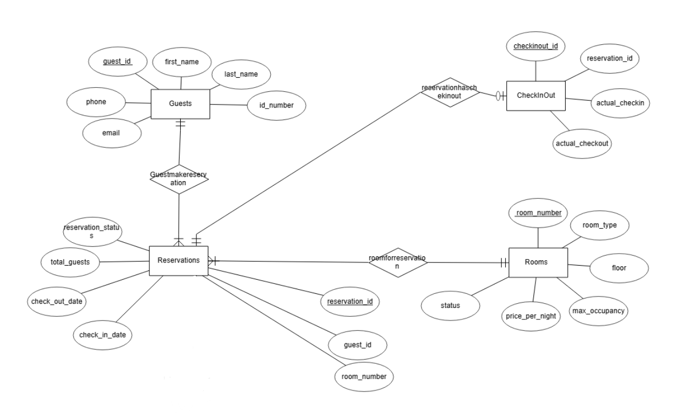
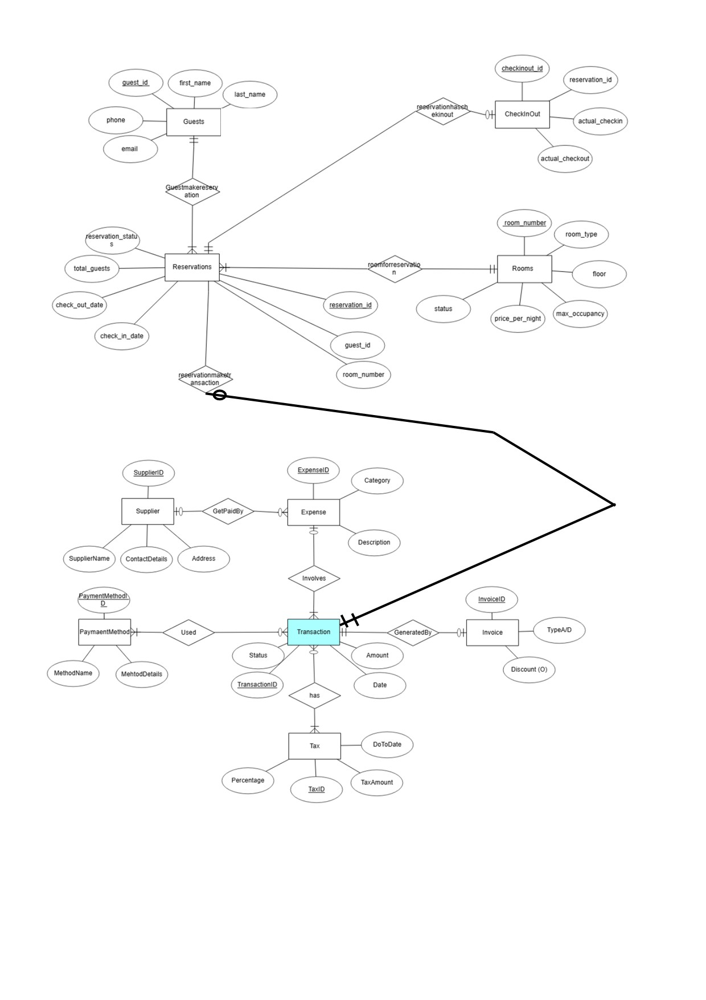
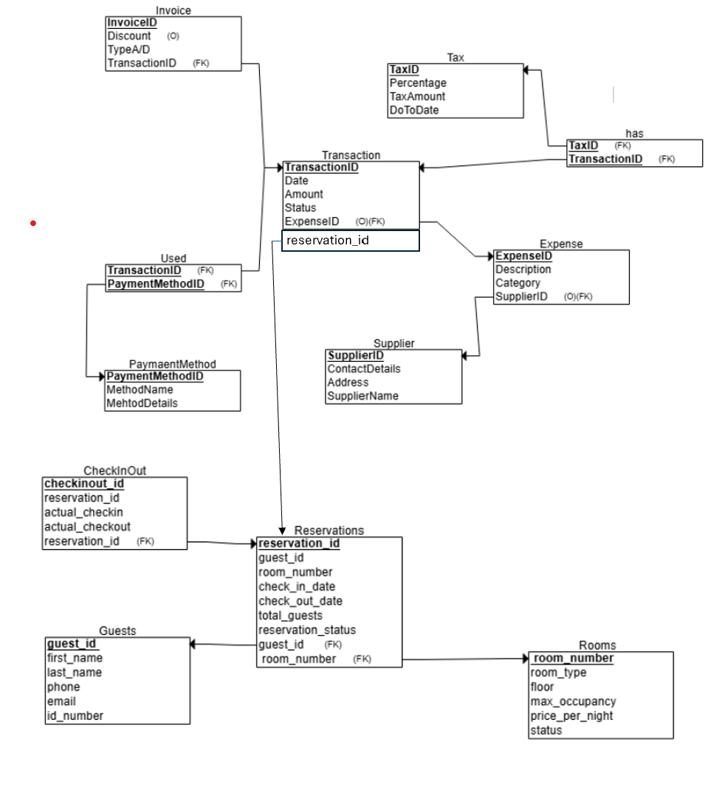
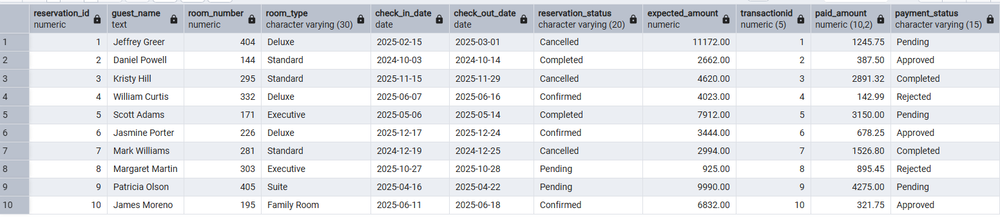
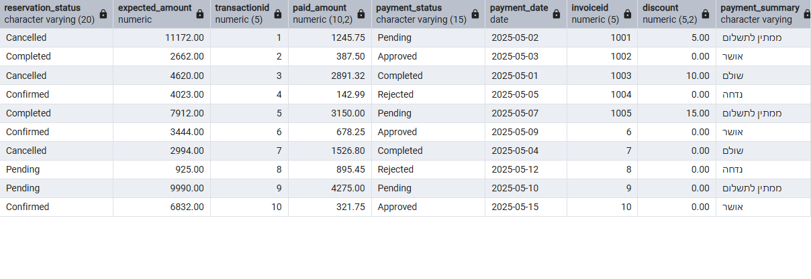

# 📝 Workshop Files & Scripts (Hanina Cohen & Oded Ofek) 🧓‍🎓

This workshop introduces key database concepts and provides hands-on practice in a controlled, containerized environment using PostgreSQL within Docker. Our project focuses on the financial part of a hotel management system, where we designed and implemented a database to track expenses, transactions, invoices, taxes, and payment methods. Below are the details of our implementation.

---

## 🎓 Team Members

* **Hanina Cohen** (ID: 337615041)
* **Oded Ofek** (ID: 215348145)

---

## 🔎 Key Concepts Covered

### Entity-Relationship Diagram (ERD)

* Designed an ERD to model relationships and entities for the financial part of a hotel management system.
* Focused on normalizing the database and ensuring scalability for tracking expenses, transactions, invoices, taxes, and payment methods.

**ERD Snapshot:**


### Data Structure Diagram (DSD) Snapshot


---

## 📊 ERD Explanation (Data Dictionary)

### Supplier

Represents a vendor or service provider from whom goods or services are purchased.

| Attribute      | Description                         | Data Type | Constraints |
| -------------- | ----------------------------------- | --------- | ----------- |
| SupplierID     | Unique identifier for each supplier | Integer   | Primary Key |
| SupplierName   | Legal name of the supplier          | Text      | Not Null    |
| ContactDetails | Phone, email, or other contact      | Text      |             |
| Address        | Physical or mailing address         | Text      |             |

### Expense

Represents a record of money spent related to business operations.

| Attribute     | Description                         | Data Type | Constraints            |
| ------------- | ----------------------------------- | --------- | ---------------------- |
| ExpenseID     | Unique identifier for each expense  | Integer   | Primary Key            |
| Description   | Details about the expense           | Text      |                        |
| Category      | Classification of expense           | Text      |                        |
| TransactionID | Reference to associated transaction | Integer   | Foreign Key (Not Null) |
| SupplierID    | Reference to the supplier           | Integer   | Foreign Key (Optional) |

### Transaction

Represents a financial event involving transfer of money.

| Attribute       | Description                       | Data Type | Constraints            |
| --------------- | --------------------------------- | --------- | ---------------------- |
| TransactionID   | Unique identifier for transaction | Integer   | Primary Key            |
| Date            | When the transaction occurred     | Date      | Not Null               |
| Amount          | Monetary value of transaction     | Decimal   | Not Null               |
| Status          | Current state of transaction      | Text      |                        |
| PaymentMethodID | Payment method used               | Integer   | Foreign Key (Not Null) |
| InvoiceID       | Reference to associated invoice   | Integer   | Foreign Key (Optional) |

### Invoice

Represents a formal document requesting payment.

| Attribute | Description                    | Data Type | Constraints |
| --------- | ------------------------------ | --------- | ----------- |
| InvoiceID | Unique identifier for invoice  | Integer   | Primary Key |
| Discount  | Discount offered by supplier   | Decimal   | Optional    |
| TypeAD    | Classification of invoice type | Text      |             |

### PaymentMethod

Represents the method by which a transaction was settled.

| Attribute       | Description                          | Data Type | Constraints |
| --------------- | ------------------------------------ | --------- | ----------- |
| PaymentMethodID | Unique identifier for payment method | Integer   | Primary Key |
| MethodName      | Name (e.g., Credit Card)             | Text      | Not Null    |
| MethodDetails   | Additional info if needed            | Text      |             |

### Tax

Information about taxation applied to a transaction.

| Attribute     | Description                      | Data Type | Constraints            |
| ------------- | -------------------------------- | --------- | ---------------------- |
| TaxID         | Unique identifier for tax record | Integer   | Primary Key            |
| TransactionID | Related transaction              | Integer   | Foreign Key (Not Null) |
| Percentage    | Tax rate applied                 | Decimal   |                        |
| TaxAmount     | Calculated tax amount            | Decimal   |                        |
| DoToDate      | Due date for payment/filing      | Date      |                        |

---

## 🛠️ Table Relationships with Notation

| Relationship Name | From (Entity) | To (Entity)     | Cardinality     | Description                                                                               |
| ----------------- | ------------- | --------------- | --------------- | ----------------------------------------------------------------------------------------- |
| `GetPaidBy`       | `Expense`     | `Supplier`      | `0..N` → `0..1` | A supplier may be linked to many expenses, and an expense may optionally have a supplier. |
| `Involves`        | `Expense`     | `Transaction`   | `1` → `1`       | Every expense must be linked to exactly one transaction.                                  |
| `GeneratedBy`     | `Transaction` | `Invoice`       | `0..1` ↔ `0..1` | A transaction may optionally generate one invoice and vice versa.                         |
| `Used`            | `Transaction` | `PaymentMethod` | `0..N` → `1`    | Each transaction uses exactly one payment method, which may be used by many transactions. |
| `Has`             | `Transaction` | `Tax`           | `0..1` ← `0..N` | A transaction can have many taxes; each tax belongs to exactly one transaction.           |

**Legend:**

* `1`: Exactly one (mandatory)
* `0..1`: Zero or one (optional)
* `0..N`: Zero or many (optional)
* `1..N`: One or many (at least one, mandatory)
* `↔`: Bidirectional

---

## 📁 Creating Tables

Translated the ERD into actual tables, defining columns, data types, primary keys, and foreign keys.
```sql
CREATE TABLE Supplier (
    SupplierID NUMERIC(5) NOT NULL,
    SupplierName VARCHAR(15) NOT NULL,
    ContactDetails VARCHAR(50) NOT NULL,
    Address VARCHAR(50) NOT NULL,
    PRIMARY KEY (SupplierID)
);

CREATE TABLE PaymentMethod (
    PaymentMethodID NUMERIC(5) NOT NULL,
    MethodName VARCHAR(15) NOT NULL,
    MethodDetails VARCHAR(50) NOT NULL,  -- Fixed typo from MehtodDetails
    PRIMARY KEY (PaymentMethodID)
);

CREATE TABLE Expense (
    ExpenseID NUMERIC(5) NOT NULL,
    Description VARCHAR(100) NOT NULL,
    Category VARCHAR(15) NOT NULL,
    SupplierID NUMERIC(5),  -- Can be NULL if expense doesn't have a supplier
    PRIMARY KEY (ExpenseID),
    FOREIGN KEY (SupplierID) REFERENCES Supplier(SupplierID)
);

CREATE TABLE Tax (
    TaxID NUMERIC(5) NOT NULL,
    Percentage NUMERIC(5,2) NOT NULL,  -- Changed to support decimals like 10.25%
    TaxAmount NUMERIC(10,2) NOT NULL,  -- Changed to NUMERIC for money values
    DueDate DATE NOT NULL,  -- Fixed typo from DoToDate
    PRIMARY KEY (TaxID)
);

CREATE TABLE Transaction (
    TransactionID NUMERIC(5) NOT NULL,
    Date DATE NOT NULL DEFAULT CURRENT_DATE,  -- Added DEFAULT for convenience
    Amount NUMERIC(10,2) NOT NULL CHECK (Amount > 0),  -- Added CHECK and changed to NUMERIC
    Status VARCHAR(15) NOT NULL DEFAULT 'Pending',  -- Added DEFAULT with common status
    ExpenseID NUMERIC(5),  -- Can be NULL if transaction isn't tied to a specific expense
    PRIMARY KEY (TransactionID),
    FOREIGN KEY (ExpenseID) REFERENCES Expense(ExpenseID)
);

CREATE TABLE Invoice (
    InvoiceID NUMERIC(5) NOT NULL,
    Discount NUMERIC(5,2),  -- Can be NULL if no discount
    Type CHAR(1) NOT NULL CHECK (Type IN ('A', 'D')),  -- Fixed column name from TypeA/D
    TransactionID NUMERIC(5) NOT NULL,
    PRIMARY KEY (InvoiceID),
    FOREIGN KEY (TransactionID) REFERENCES Transaction(TransactionID)
);

CREATE TABLE Used (
    TransactionID NUMERIC(5) NOT NULL,
    PaymentMethodID NUMERIC(5) NOT NULL,
    PRIMARY KEY (TransactionID, PaymentMethodID),
    FOREIGN KEY (TransactionID) REFERENCES Transaction(TransactionID),
    FOREIGN KEY (PaymentMethodID) REFERENCES PaymentMethod(PaymentMethodID)
);

CREATE TABLE Has (
    TaxID NUMERIC(5) NOT NULL,
    TransactionID NUMERIC(5) NOT NULL,
    PRIMARY KEY (TaxID, TransactionID),
    FOREIGN KEY (TaxID) REFERENCES Tax(TaxID),
    FOREIGN KEY (TransactionID) REFERENCES Transaction(TransactionID)
);
```

**Table Creation Snapshot:**


---

## 📝 Sample Data

Generated realistic sample data using SQL `INSERT` statements.

**Excel Snapshot:**


**CSV Snapshot:**


---

## 🔢 SQL Queries

Practiced writing queries to analyze financial data.

```sql
-- Query to get total expenses per supplier with tax details
SELECT
    s.SupplierName,
    SUM(e.Amount) AS TotalExpense,
    SUM(t.TaxAmount) AS TotalTax,
    t.Percentage
FROM Supplier s
JOIN Expense e ON s.SupplierID = e.SupplierID
JOIN Transaction tr ON e.TransactionID = tr.TransactionID
JOIN Tax t ON tr.TransactionID = t.TransactionID
GROUP BY s.SupplierName, t.Percentage
ORDER BY TotalExpense DESC;
```

---

## 📊 Stored Procedures and Functions

Created a stored procedure to calculate total tax for a given transaction.

```sql
CREATE OR REPLACE PROCEDURE CalculateTotalTaxForTransaction(p_TransactionID INTEGER)
LANGUAGE plpgsql
AS $$
DECLARE
    v_TotalTax DECIMAL;
BEGIN
    SELECT SUM(TaxAmount) INTO v_TotalTax
    FROM Tax
    WHERE TransactionID = p_TransactionID;

    RAISE NOTICE 'Total Tax for Transaction %: %', p_TransactionID, v_TotalTax;
END;
$$;

-- Call it:
CALL CalculateTotalTaxForTransaction(1);
```

---

## 🔍 Views

Created a view to simplify querying expense, supplier, and tax details.

```sql
CREATE VIEW ExpenseSummary AS
SELECT
    e.ExpenseID,
    e.Description,
    e.Category,
    s.SupplierName,
    tr.Amount,
    t.TaxAmount,
    t.Percentage
FROM Expense e
JOIN Supplier s ON e.SupplierID = s.SupplierID
JOIN Transaction tr ON e.TransactionID = tr.TransactionID
JOIN Tax t ON tr.TransactionID = t.TransactionID;

-- Query the view
SELECT * FROM ExpenseSummary;
```
## 📘 Stage B – Queries, Constraints, and Transactions

This stage focuses on querying the database, enforcing integrity constraints, and demonstrating transactional control. The work in this stage reflects the business logic needed for interacting with the financial subsystem of our hotel management system.

---

### 🔍 SQL Queries

We wrote complex SELECT, DELETE, and UPDATE queries that span multiple tables, utilize aggregate functions, joins, date logic, and grouping mechanisms.

All queries are numbered sequentially for clarity.

#### 🟢 Query 1 – Expenses with Suppliers and Transactions

```sql
SELECT 
  E.ExpenseID,
  E.Description,
  E.Category,
  S.SupplierName,
  T.Amount
FROM Expense E
JOIN Supplier S ON E.SupplierID = S.SupplierID
LEFT JOIN Transaction T ON E.ExpenseID = T.ExpenseID;
```

📸 Screenshot A – Result with columns from multiple tables


#### 🟢 Query 2 – Payment Methods Used in Transactions

```sql
SELECT 
  T.transactionid,
  T.date,
  PM.methodname,
  PM.methoddetails
FROM transaction T
JOIN "paymentMethodUsedInTransaction" U ON T.transactionid = U.transactionid
JOIN paymentmethod PM ON U.paymentmethodid = PM.paymentmethodid;
```

📸 Screenshot B – Results with detailed method names


#### 🟢 Query 3 – Total Spending per Supplier

```sql
SELECT 
  S.SupplierName,
  SUM(T.Amount) AS TotalSpent
FROM Supplier S
JOIN Expense E ON S.SupplierID = E.SupplierID
JOIN Transaction T ON E.ExpenseID = T.ExpenseID
GROUP BY S.SupplierName;
```

📸 Screenshot C – Aggregate spending by supplier


#### 🟢 Query 4 – Supplier Expense Counts

```sql
SELECT 
  Supplier.SupplierName,
  COUNT(Expense.ExpenseID) AS TotalExpenses
FROM Supplier
LEFT JOIN Expense ON Supplier.SupplierID = Expense.SupplierID
GROUP BY Supplier.SupplierName;
```

📸 Screenshot D – Number of expenses per supplier


#### 🟢 Query 5 – Transactions Without Taxes

```sql
SELECT T.transactionid
FROM transaction T
LEFT JOIN "transactionHasTax" H ON T.transactionid = H.transactionid
WHERE H.taxid IS NULL;
```

📸 Screenshot E – Transactions missing tax relationships


#### 🟢 Query 6 – Transaction Summary by Supplier, Category, and Payment Method

```sql
SELECT 
    T.TransactionID,
    T.Date,
    T.Amount,
    E.Category,
    S.SupplierName,
    PM.MethodName
FROM Transaction T
LEFT JOIN Expense E ON T.ExpenseID = E.ExpenseID
LEFT JOIN Supplier S ON E.SupplierID = S.SupplierID
LEFT JOIN "paymentMethodUsedInTransaction" U ON T.TransactionID = U.TransactionID
LEFT JOIN PaymentMethod PM ON U.PaymentMethodID = PM.PaymentMethodID;
```

📸 Screenshot F – Full context of each transaction


#### 🟢 Query 7 – Supplier with Highest Total Transaction Amount

```sql
SELECT SupplierName
FROM (
  SELECT 
    S.SupplierName,
    SUM(T.Amount) AS Total
  FROM Supplier S
  JOIN Expense E ON S.SupplierID = E.SupplierID
  JOIN Transaction T ON T.ExpenseID = E.ExpenseID
  GROUP BY S.SupplierName
  ORDER BY Total DESC
  LIMIT 1
) AS TopSupplier;
```

📸 Screenshot G – Top supplier only


#### 🟢 Query 8 – Invoices from the Last 30 Days

```sql
SELECT *
FROM Transaction
WHERE Date >= CURRENT_DATE - INTERVAL '30 days';
```

📸 Screenshot H – Recent transactions


#### 🟢 Query 9 – Final Invoice Amounts (after Discount)

```sql
SELECT 
  Invoice.InvoiceID,
  Transaction.Amount,
  Invoice.Discount,
  (Transaction.Amount - COALESCE(Invoice.Discount, 0)) AS FinalAmount
FROM Invoice
JOIN Transaction ON Invoice.TransactionID = Transaction.TransactionID;
```

📸 Screenshot I – Invoice totals with discount


#### 🟢 Query 10 – Transactions Above a Threshold

```sql
SELECT * 
FROM Transaction
WHERE Amount > 10000;
```

📸 Screenshot J – High value transactions


#### 🟢 Query 11 – Average Tax Rate

```sql
SELECT AVG(Percentage) AS AvgTaxRate
FROM Tax;
```

📸 Screenshot K – Mean percentage


#### 🟢 Query 12 – Tax Details Per Transaction

```sql
SELECT 
  T.transactionid,
  Tax.taxamount,
  Tax.percentage,
  Tax.duedate
FROM transaction T
JOIN "transactionHasTax" H ON T.transactionid = H.transactionid
JOIN tax ON H.taxid = Tax.taxid;
```

📸 Screenshot L – Taxes with amounts and deadlines


#### 🟢 Query 13 – Top 5 Suppliers by Transaction Count

```sql
SELECT 
  S.SupplierName,
  COUNT(T.TransactionID) AS TransactionCount
FROM Supplier S
JOIN Expense E ON S.SupplierID = E.SupplierID
JOIN Transaction T ON E.ExpenseID = T.ExpenseID
GROUP BY S.SupplierName
ORDER BY TransactionCount DESC
LIMIT 5;
```

📸 Screenshot M – Supplier rankings


---

### 🧹 DELETE Operations

#### Delete Rejected Invoices 

```sql
DELETE FROM invoice
WHERE transactionid IN (
    SELECT transactionid
    FROM transaction
    WHERE status = 'Rejected'
);
```

📸 Screenshot O – Invoice table before and after


#### Delete Old Tax Links 

```sql
DELETE FROM "transactionHasTax"
WHERE transactionid IN (
    SELECT transactionid 
    FROM transaction 
    WHERE status = 'Completed' AND date < '2025-05-06'
);
```

📸 Screenshot P – Relationship cleanup


#### Delete Old Payment Links 

```sql
DELETE FROM "paymentMethodUsedInTransaction"
WHERE transactionid IN (
    SELECT transactionid 
    FROM transaction 
    WHERE status = 'Completed' AND date < '2025-05-06'
);
```

📸 Screenshot Q – Payment linkage cleaned


---

### ✏️ UPDATE Operations

#### Update Invoice Discounts 

```sql
UPDATE invoice
SET discount = 0.10
WHERE type = 'D';
```


#### Standardize Supplier Contact 
```sql
UPDATE supplier
SET contactdetails = CONCAT(suppliername, '@business.com')
WHERE contactdetails IS NULL 
OR contactdetails = '' 
OR contactdetails NOT LIKE '%@%'
OR contactdetails = 'supplier1@domain.com, 050-1234501';
```


#### Apply Late Fees 

```sql
UPDATE transaction
SET amount = amount * 1.05
WHERE date < CURRENT_DATE - INTERVAL '30 days'
AND status = 'Pending';
```


---

### ✅ Transaction Control

#### COMMIT Example 

```sql
BEGIN;
UPDATE transaction
SET status = 'Completed'
WHERE status = 'Pending';
COMMIT;
```

📸 Screenshot S – Final committed state


#### ROLLBACK Example (Query 22)

```sql
BEGIN;
UPDATE supplier 
SET contactdetails = 'updated@example.com, 050-1234501' 
WHERE contactdetails IS NULL OR contactdetails = 'supplier1@domain.com, 050-1234501';
-- Check state
SELECT * FROM supplier
WHERE contactdetails = 'updated@example.com, 050-1234501';
ROLLBACK;
```

📸 Screenshot T – Reverted update


---

### 📏 Constraints

#### Constraint 1 – NOT NULL on Transaction Amount

```sql
ALTER TABLE transaction
ALTER COLUMN amount SET NOT NULL;
```

#### Constraint 2 – DEFAULT on Payment Method Details

```sql
ALTER TABLE paymentmethod
ALTER COLUMN methoddetails SET DEFAULT 'USD';
```

#### Constraint 3 – DEFAULT on Transaction Status

```sql
ALTER TABLE transaction
ALTER COLUMN status SET DEFAULT 'Approved';
```


# 📘 Stage C – Integration and Views

This stage focuses on integrating our financial management system with another hotel department's database system. We created a backup of the Reception department's database and performed a complete integration process, creating views and complex queries that span both systems.

---

## 🔄 Integration Process Overview

### Step 1: Creating a database to perform integration

We created another database to integrate with it.

**Reception Department DSD:**


### Step 2: Creating ERD from Reception DSD

From the DSD analysis, we created the ERD for the Reception department to understand the relationships and entities.

**Reception Department ERD:**


### Step 3: Integrated ERD Design

We designed a combined ERD that integrates both the Financial and Reception departments, making key design decisions about relationships and data flow.

**Integrated ERD:**


### Step 4: Final Integrated DSD

The final database structure after integration, showing all tables and relationships.

**Final Integrated DSD:**


---

## 🛠️ Integration Implementation

### Integration SQL Commands

```sql
-- Enable Foreign Data Wrapper
CREATE EXTENSION IF NOT EXISTS postgres_fdw;

-- Create Foreign Server Connection
CREATE SERVER reception_server
FOREIGN DATA WRAPPER postgres_fdw
OPTIONS (host 'localhost', port '5432', dbname 'DB25785_4051_8145');

-- Create User Mapping for Authentication
CREATE USER MAPPING FOR CURRENT_USER
SERVER reception_server
OPTIONS (user 'postgres', password '123');

-- Import Foreign Schema
IMPORT FOREIGN SCHEMA public
LIMIT TO (guests, rooms, reservations, checkinout)
FROM SERVER reception_server
INTO public;

-- Rename Foreign Tables
ALTER FOREIGN TABLE guests RENAME TO foreign_guests;
ALTER FOREIGN TABLE rooms RENAME TO foreign_rooms;
ALTER FOREIGN TABLE reservations RENAME TO foreign_reservations;
ALTER FOREIGN TABLE checkinout RENAME TO foreign_checkinout;

-- Create Integration Tables
CREATE TABLE reservationfinancelink (
    link_id integer PRIMARY KEY,
    reservation_id numeric NOT NULL,
    transaction_id numeric NOT NULL,
    created_date timestamp without time zone DEFAULT CURRENT_TIMESTAMP,
    CONSTRAINT fk_transaction FOREIGN KEY (transaction_id) REFERENCES Transaction(TransactionID)
);

CREATE TABLE reservationsync (
    reservation_id numeric NOT NULL,
    guest_name character varying,
    room_number numeric,
    check_in_date date,
    check_out_date date,
    total_amount numeric,
    sync_date timestamp without time zone DEFAULT CURRENT_TIMESTAMP
);
```

---

## 👁️ Views Implementation

### View 1: Financial Department Perspective
**View Name:** `financial_reservation_view`

This view provides the financial department with a comprehensive overview of all reservations and their associated financial transactions, including payment status and expected vs. actual amounts.

```sql
CREATE OR REPLACE VIEW financial_reservation_view AS
SELECT 
    r.reservation_id,
    (g.first_name || ' ' || g.last_name) AS guest_name,
    r.room_number,
    ro.room_type,
    r.check_in_date,
    r.check_out_date,
    r.reservation_status,
    (ro.price_per_night * ((r.check_out_date - r.check_in_date)::numeric)) AS expected_amount,
    t.transactionid,
    t.amount AS paid_amount,
    t.status AS payment_status,
    t.date AS payment_date,
    i.invoiceid,
    i.discount,
    CASE
        WHEN t.transactionid IS NULL THEN 'Not Paid'
        WHEN t.status = 'Completed' THEN 'Paid'
        WHEN t.status = 'Pending' THEN 'Pending Payment'
        WHEN t.status = 'Approved' THEN 'Approved'
        WHEN t.status = 'Rejected' THEN 'Rejected'
        ELSE t.status
    END AS payment_summary
FROM foreign_reservations r
JOIN foreign_guests g ON r.guest_id = g.guest_id
JOIN foreign_rooms ro ON r.room_number = ro.room_number
LEFT JOIN reservationfinancelink rfl ON r.reservation_id = rfl.reservation_id
LEFT JOIN transaction t ON rfl.transaction_id = t.transactionid
LEFT JOIN invoice i ON t.transactionid = i.transactionid;
```

**View Description:** This view combines reservation data with financial transaction details, allowing the finance department to track expected vs. actual payments, identify outstanding balances, and monitor payment statuses across all guest reservations. The view includes calculated fields for payment summaries and expected amounts based on room rates and stay duration.

**Sample Data from View:**
```sql
SELECT * FROM financial_reservation_view LIMIT 10;
```




### View 2: Reception Department Perspective
**View Name:** `reception_occupancy_financial_view`

This view provides the reception department with room occupancy information combined with financial performance data, helping them understand revenue generation and payment status by room.

```sql
CREATE OR REPLACE VIEW reception_occupancy_financial_view AS
SELECT 
    ro.room_number,
    ro.room_type,
    ro.floor,
    ro.status as room_status,
    ro.price_per_night,
    COUNT(DISTINCT r.reservation_id) as total_reservations,
    COUNT(DISTINCT CASE 
        WHEN r.check_in_date <= CURRENT_DATE AND r.check_out_date >= CURRENT_DATE 
        THEN r.reservation_id 
    END) as current_occupation,
    COALESCE(SUM(t.amount), 0) as total_revenue,
    AVG(i.discount) as avg_discount,
    COUNT(DISTINCT CASE 
        WHEN t.status = 'Completed' THEN rfl.reservation_id 
    END) as paid_reservations,
    COUNT(DISTINCT CASE 
        WHEN t.status = 'Pending' THEN rfl.reservation_id 
    END) as pending_payments
FROM foreign_rooms ro
LEFT JOIN foreign_reservations r ON ro.room_number = r.room_number
LEFT JOIN reservationfinancelink rfl ON r.reservation_id = rfl.reservation_id
LEFT JOIN transaction t ON rfl.transaction_id = t.transactionid
LEFT JOIN invoice i ON t.transactionid = i.transactionid
GROUP BY ro.room_number, ro.room_type, ro.floor, ro.status, ro.price_per_night;
```

**View Description:** This view aggregates room occupancy data with financial metrics, providing reception staff with insights into room performance, current occupancy status, revenue generation, and payment statuses. It helps identify rooms that require payment follow-up and provides occupancy analytics for better room management.

**Sample Data from View:**
```sql
SELECT * FROM reception_occupancy_financial_view LIMIT 10;
```


---

## 🔍 Queries on Views

### Queries on Financial View

#### Query 1.1: Outstanding Payments Report
```sql
SELECT 
    guest_name,
    room_number,
    room_type,
    check_in_date,
    check_out_date,
    expected_amount,
    COALESCE(paid_amount, 0) as paid_amount,
    expected_amount - COALESCE(paid_amount, 0) as balance_due,
    payment_summary
FROM financial_reservation_view
WHERE payment_status IS NULL OR payment_status != 'Completed'
ORDER BY balance_due DESC
LIMIT 10;
```

**Purpose:** Identify reservations with unpaid or pending payments to prioritize collection efforts and follow up with guests who have outstanding balances.


#### Query 1.2: Revenue Analysis by Room Type
```sql
SELECT 
    room_type,
    COUNT(*) as total_reservations,
    COUNT(transactionid) as paid_reservations,
    SUM(expected_amount) as expected_revenue,
    SUM(paid_amount) as actual_revenue,
    AVG(discount) as average_discount,
    SUM(expected_amount) - SUM(paid_amount) as revenue_gap
FROM financial_reservation_view
GROUP BY room_type
ORDER BY actual_revenue DESC;
```

**Purpose:** Analyze revenue performance by room type, including the impact of discounts and identify revenue gaps that need attention.

### Queries on Reception View

#### Query 2.1: Room Performance Summary
```sql
SELECT 
    room_type,
    COUNT(*) as total_rooms,
    SUM(total_reservations) as total_bookings,
    SUM(current_occupation) as currently_occupied,
    SUM(total_revenue) as total_revenue_generated,
    AVG(price_per_night) as avg_room_price,
    ROUND(AVG(avg_discount), 2) as avg_discount_given
FROM reception_occupancy_financial_view
GROUP BY room_type
ORDER BY total_revenue_generated DESC;
```

**Purpose:** Evaluate room utilization and revenue generation by room type to inform pricing strategies and identify high-performing room categories.

#### Query 2.2: Payment Status Alert by Room
```sql
SELECT 
    room_number,
    room_type,
    floor,
    price_per_night,
    total_reservations,
    paid_reservations,
    pending_payments,
    total_revenue,
    CASE 
        WHEN pending_payments > 0 THEN 'Action Required'
        WHEN total_reservations > paid_reservations THEN 'Check Required'
        ELSE 'OK'
    END as payment_status_alert
FROM reception_occupancy_financial_view
WHERE pending_payments > 0 OR (total_reservations > paid_reservations)
ORDER BY pending_payments DESC, room_number
LIMIT 15;
```

**Purpose:** Identify rooms with pending payments for follow-up and alert reception staff to potential payment issues that require immediate attention.

---

## 📊 Integration Verification

### Data Consistency Checks

We performed several verification queries to ensure data integrity across the integrated system:

```sql
-- Verify foreign table connections
SELECT 'Foreign Guests' as table_name, COUNT(*) as record_count FROM foreign_guests
UNION ALL
SELECT 'Foreign Rooms', COUNT(*) FROM foreign_rooms
UNION ALL
SELECT 'Foreign Reservations', COUNT(*) FROM foreign_reservations
UNION ALL
SELECT 'Foreign CheckInOut', COUNT(*) FROM foreign_checkinout;

-- Verify integration table population
SELECT 'Reservation-Finance Links' as table_name, COUNT(*) as record_count FROM reservationfinancelink
UNION ALL
SELECT 'Reservation Sync', COUNT(*) FROM reservationsync;
```

---

## 🔐 Security and Permissions

We implemented appropriate security measures for the integrated system:

```sql
-- Grant permissions on foreign tables
GRANT SELECT ON foreign_guests TO PUBLIC;
GRANT SELECT ON foreign_rooms TO PUBLIC;
GRANT SELECT ON foreign_reservations TO PUBLIC;
GRANT SELECT ON foreign_checkinout TO PUBLIC;

-- Grant permissions on integration tables
GRANT ALL ON reservationfinancelink TO PUBLIC;
GRANT ALL ON reservationsync TO PUBLIC;

-- Grant permissions on views
GRANT SELECT ON FinancialTransactionSummary TO PUBLIC;
GRANT SELECT ON ReceptionFinancialOverview TO PUBLIC;
```

---

---
