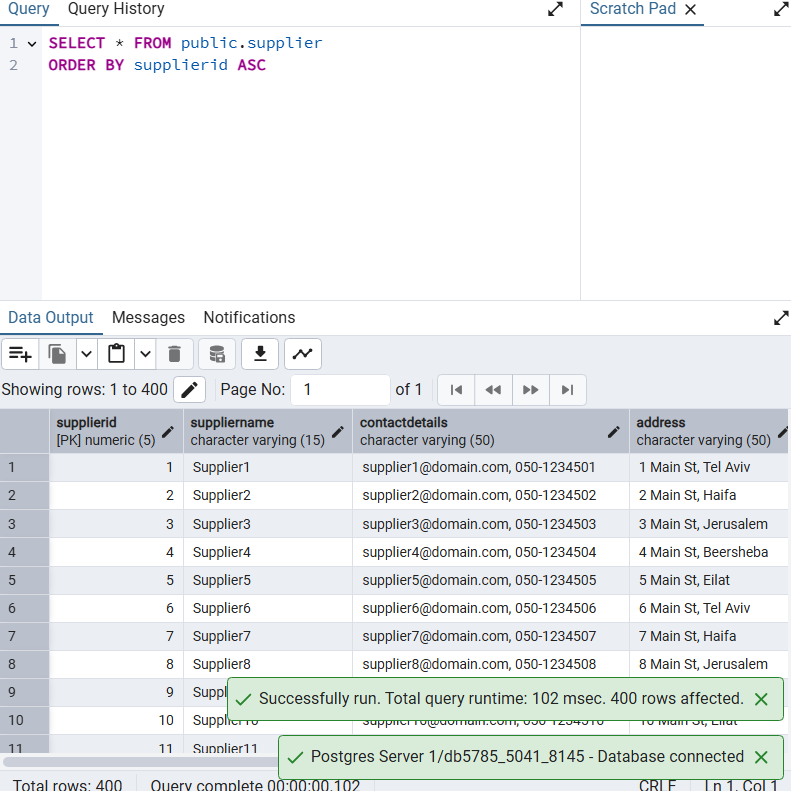
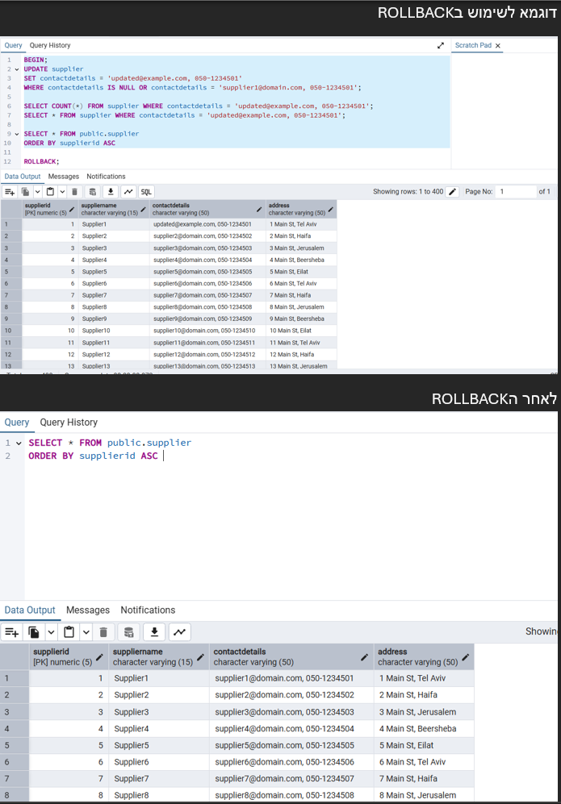

# 📝 Workshop Files & Scripts (Hanina Cohen & Oded Ofek) 🧓‍🎓

This workshop introduces key database concepts and provides hands-on practice in a controlled, containerized environment using PostgreSQL within Docker. Our project focuses on the financial part of a hotel management system, where we designed and implemented a database to track expenses, transactions, invoices, taxes, and payment methods. Below are the details of our implementation.

---

## 🎓 Team Members

* **Hanina Cohen** (ID: 337615041)
* **Oded Ofek** (ID: 215348145)

---

## 🔎 Key Concepts Covered

### Entity-Relationship Diagram (ERD)

* Designed an ERD to model relationships and entities for the financial part of a hotel management system.
* Focused on normalizing the database and ensuring scalability for tracking expenses, transactions, invoices, taxes, and payment methods.

**ERD Snapshot:**


### Data Structure Diagram (DSD) Snapshot


---

## 📊 ERD Explanation (Data Dictionary)

### Supplier

Represents a vendor or service provider from whom goods or services are purchased.

| Attribute      | Description                         | Data Type | Constraints |
| -------------- | ----------------------------------- | --------- | ----------- |
| SupplierID     | Unique identifier for each supplier | Integer   | Primary Key |
| SupplierName   | Legal name of the supplier          | Text      | Not Null    |
| ContactDetails | Phone, email, or other contact      | Text      |             |
| Address        | Physical or mailing address         | Text      |             |

### Expense

Represents a record of money spent related to business operations.

| Attribute     | Description                         | Data Type | Constraints            |
| ------------- | ----------------------------------- | --------- | ---------------------- |
| ExpenseID     | Unique identifier for each expense  | Integer   | Primary Key            |
| Description   | Details about the expense           | Text      |                        |
| Category      | Classification of expense           | Text      |                        |
| TransactionID | Reference to associated transaction | Integer   | Foreign Key (Not Null) |
| SupplierID    | Reference to the supplier           | Integer   | Foreign Key (Optional) |

### Transaction

Represents a financial event involving transfer of money.

| Attribute       | Description                       | Data Type | Constraints            |
| --------------- | --------------------------------- | --------- | ---------------------- |
| TransactionID   | Unique identifier for transaction | Integer   | Primary Key            |
| Date            | When the transaction occurred     | Date      | Not Null               |
| Amount          | Monetary value of transaction     | Decimal   | Not Null               |
| Status          | Current state of transaction      | Text      |                        |
| PaymentMethodID | Payment method used               | Integer   | Foreign Key (Not Null) |
| InvoiceID       | Reference to associated invoice   | Integer   | Foreign Key (Optional) |

### Invoice

Represents a formal document requesting payment.

| Attribute | Description                    | Data Type | Constraints |
| --------- | ------------------------------ | --------- | ----------- |
| InvoiceID | Unique identifier for invoice  | Integer   | Primary Key |
| Discount  | Discount offered by supplier   | Decimal   | Optional    |
| TypeAD    | Classification of invoice type | Text      |             |

### PaymentMethod

Represents the method by which a transaction was settled.

| Attribute       | Description                          | Data Type | Constraints |
| --------------- | ------------------------------------ | --------- | ----------- |
| PaymentMethodID | Unique identifier for payment method | Integer   | Primary Key |
| MethodName      | Name (e.g., Credit Card)             | Text      | Not Null    |
| MethodDetails   | Additional info if needed            | Text      |             |

### Tax

Information about taxation applied to a transaction.

| Attribute     | Description                      | Data Type | Constraints            |
| ------------- | -------------------------------- | --------- | ---------------------- |
| TaxID         | Unique identifier for tax record | Integer   | Primary Key            |
| TransactionID | Related transaction              | Integer   | Foreign Key (Not Null) |
| Percentage    | Tax rate applied                 | Decimal   |                        |
| TaxAmount     | Calculated tax amount            | Decimal   |                        |
| DoToDate      | Due date for payment/filing      | Date      |                        |

---

## 🛠️ Table Relationships with Notation

| Relationship Name | From (Entity) | To (Entity)     | Cardinality     | Description                                                                               |
| ----------------- | ------------- | --------------- | --------------- | ----------------------------------------------------------------------------------------- |
| `GetPaidBy`       | `Expense`     | `Supplier`      | `0..N` → `0..1` | A supplier may be linked to many expenses, and an expense may optionally have a supplier. |
| `Involves`        | `Expense`     | `Transaction`   | `1` → `1`       | Every expense must be linked to exactly one transaction.                                  |
| `GeneratedBy`     | `Transaction` | `Invoice`       | `0..1` ↔ `0..1` | A transaction may optionally generate one invoice and vice versa.                         |
| `Used`            | `Transaction` | `PaymentMethod` | `0..N` → `1`    | Each transaction uses exactly one payment method, which may be used by many transactions. |
| `Has`             | `Transaction` | `Tax`           | `0..1` ← `0..N` | A transaction can have many taxes; each tax belongs to exactly one transaction.           |

**Legend:**

* `1`: Exactly one (mandatory)
* `0..1`: Zero or one (optional)
* `0..N`: Zero or many (optional)
* `1..N`: One or many (at least one, mandatory)
* `↔`: Bidirectional

---

## 📁 Creating Tables

Translated the ERD into actual tables, defining columns, data types, primary keys, and foreign keys.
```sql
CREATE TABLE Supplier (
    SupplierID NUMERIC(5) NOT NULL,
    SupplierName VARCHAR(15) NOT NULL,
    ContactDetails VARCHAR(50) NOT NULL,
    Address VARCHAR(50) NOT NULL,
    PRIMARY KEY (SupplierID)
);

CREATE TABLE PaymentMethod (
    PaymentMethodID NUMERIC(5) NOT NULL,
    MethodName VARCHAR(15) NOT NULL,
    MethodDetails VARCHAR(50) NOT NULL,  -- Fixed typo from MehtodDetails
    PRIMARY KEY (PaymentMethodID)
);

CREATE TABLE Expense (
    ExpenseID NUMERIC(5) NOT NULL,
    Description VARCHAR(100) NOT NULL,
    Category VARCHAR(15) NOT NULL,
    SupplierID NUMERIC(5),  -- Can be NULL if expense doesn't have a supplier
    PRIMARY KEY (ExpenseID),
    FOREIGN KEY (SupplierID) REFERENCES Supplier(SupplierID)
);

CREATE TABLE Tax (
    TaxID NUMERIC(5) NOT NULL,
    Percentage NUMERIC(5,2) NOT NULL,  -- Changed to support decimals like 10.25%
    TaxAmount NUMERIC(10,2) NOT NULL,  -- Changed to NUMERIC for money values
    DueDate DATE NOT NULL,  -- Fixed typo from DoToDate
    PRIMARY KEY (TaxID)
);

CREATE TABLE Transaction (
    TransactionID NUMERIC(5) NOT NULL,
    Date DATE NOT NULL DEFAULT CURRENT_DATE,  -- Added DEFAULT for convenience
    Amount NUMERIC(10,2) NOT NULL CHECK (Amount > 0),  -- Added CHECK and changed to NUMERIC
    Status VARCHAR(15) NOT NULL DEFAULT 'Pending',  -- Added DEFAULT with common status
    ExpenseID NUMERIC(5),  -- Can be NULL if transaction isn't tied to a specific expense
    PRIMARY KEY (TransactionID),
    FOREIGN KEY (ExpenseID) REFERENCES Expense(ExpenseID)
);

CREATE TABLE Invoice (
    InvoiceID NUMERIC(5) NOT NULL,
    Discount NUMERIC(5,2),  -- Can be NULL if no discount
    Type CHAR(1) NOT NULL CHECK (Type IN ('A', 'D')),  -- Fixed column name from TypeA/D
    TransactionID NUMERIC(5) NOT NULL,
    PRIMARY KEY (InvoiceID),
    FOREIGN KEY (TransactionID) REFERENCES Transaction(TransactionID)
);

CREATE TABLE Used (
    TransactionID NUMERIC(5) NOT NULL,
    PaymentMethodID NUMERIC(5) NOT NULL,
    PRIMARY KEY (TransactionID, PaymentMethodID),
    FOREIGN KEY (TransactionID) REFERENCES Transaction(TransactionID),
    FOREIGN KEY (PaymentMethodID) REFERENCES PaymentMethod(PaymentMethodID)
);

CREATE TABLE Has (
    TaxID NUMERIC(5) NOT NULL,
    TransactionID NUMERIC(5) NOT NULL,
    PRIMARY KEY (TaxID, TransactionID),
    FOREIGN KEY (TaxID) REFERENCES Tax(TaxID),
    FOREIGN KEY (TransactionID) REFERENCES Transaction(TransactionID)
);
```

**Table Creation Snapshot:**


---

## 📝 Sample Data

Generated realistic sample data using SQL `INSERT` statements.

**Excel Snapshot:**


**CSV Snapshot:**


---

## 🔢 SQL Queries

Practiced writing queries to analyze financial data.

```sql
-- Query to get total expenses per supplier with tax details
SELECT
    s.SupplierName,
    SUM(e.Amount) AS TotalExpense,
    SUM(t.TaxAmount) AS TotalTax,
    t.Percentage
FROM Supplier s
JOIN Expense e ON s.SupplierID = e.SupplierID
JOIN Transaction tr ON e.TransactionID = tr.TransactionID
JOIN Tax t ON tr.TransactionID = t.TransactionID
GROUP BY s.SupplierName, t.Percentage
ORDER BY TotalExpense DESC;
```

---

## 📊 Stored Procedures and Functions

Created a stored procedure to calculate total tax for a given transaction.

```sql
CREATE OR REPLACE PROCEDURE CalculateTotalTaxForTransaction(p_TransactionID INTEGER)
LANGUAGE plpgsql
AS $$
DECLARE
    v_TotalTax DECIMAL;
BEGIN
    SELECT SUM(TaxAmount) INTO v_TotalTax
    FROM Tax
    WHERE TransactionID = p_TransactionID;

    RAISE NOTICE 'Total Tax for Transaction %: %', p_TransactionID, v_TotalTax;
END;
$$;

-- Call it:
CALL CalculateTotalTaxForTransaction(1);
```

---

## 🔍 Views

Created a view to simplify querying expense, supplier, and tax details.

```sql
CREATE VIEW ExpenseSummary AS
SELECT
    e.ExpenseID,
    e.Description,
    e.Category,
    s.SupplierName,
    tr.Amount,
    t.TaxAmount,
    t.Percentage
FROM Expense e
JOIN Supplier s ON e.SupplierID = s.SupplierID
JOIN Transaction tr ON e.TransactionID = tr.TransactionID
JOIN Tax t ON tr.TransactionID = t.TransactionID;

-- Query the view
SELECT * FROM ExpenseSummary;
```
## 📘 Stage B – Queries, Constraints, and Transactions

This stage focuses on querying the database, enforcing integrity constraints, and demonstrating transactional control. The work in this stage reflects the business logic needed for interacting with the financial subsystem of our hotel management system.

---

### 🔍 SQL Queries

We wrote complex SELECT, DELETE, and UPDATE queries that span multiple tables, utilize aggregate functions, joins, date logic, and grouping mechanisms.

All queries are numbered sequentially for clarity.

#### 🟢 Query 1 – Expenses with Suppliers and Transactions

```sql
SELECT 
  E.ExpenseID,
  E.Description,
  E.Category,
  S.SupplierName,
  T.Amount
FROM Expense E
JOIN Supplier S ON E.SupplierID = S.SupplierID
LEFT JOIN Transaction T ON E.ExpenseID = T.ExpenseID;
```

📸 Screenshot A – Result with columns from multiple tables


#### 🟢 Query 2 – Payment Methods Used in Transactions

```sql
SELECT 
  T.transactionid,
  T.date,
  PM.methodname,
  PM.methoddetails
FROM transaction T
JOIN "paymentMethodUsedInTransaction" U ON T.transactionid = U.transactionid
JOIN paymentmethod PM ON U.paymentmethodid = PM.paymentmethodid;
```

📸 Screenshot B – Results with detailed method names


#### 🟢 Query 3 – Total Spending per Supplier

```sql
SELECT 
  S.SupplierName,
  SUM(T.Amount) AS TotalSpent
FROM Supplier S
JOIN Expense E ON S.SupplierID = E.SupplierID
JOIN Transaction T ON E.ExpenseID = T.ExpenseID
GROUP BY S.SupplierName;
```

📸 Screenshot C – Aggregate spending by supplier


#### 🟢 Query 4 – Supplier Expense Counts

```sql
SELECT 
  Supplier.SupplierName,
  COUNT(Expense.ExpenseID) AS TotalExpenses
FROM Supplier
LEFT JOIN Expense ON Supplier.SupplierID = Expense.SupplierID
GROUP BY Supplier.SupplierName;
```

📸 Screenshot D – Number of expenses per supplier


#### 🟢 Query 5 – Transactions Without Taxes

```sql
SELECT T.transactionid
FROM transaction T
LEFT JOIN "transactionHasTax" H ON T.transactionid = H.transactionid
WHERE H.taxid IS NULL;
```

📸 Screenshot E – Transactions missing tax relationships


#### 🟢 Query 6 – Transaction Summary by Supplier, Category, and Payment Method

```sql
SELECT 
    T.TransactionID,
    T.Date,
    T.Amount,
    E.Category,
    S.SupplierName,
    PM.MethodName
FROM Transaction T
LEFT JOIN Expense E ON T.ExpenseID = E.ExpenseID
LEFT JOIN Supplier S ON E.SupplierID = S.SupplierID
LEFT JOIN "paymentMethodUsedInTransaction" U ON T.TransactionID = U.TransactionID
LEFT JOIN PaymentMethod PM ON U.PaymentMethodID = PM.PaymentMethodID;
```

📸 Screenshot F – Full context of each transaction


#### 🟢 Query 7 – Supplier with Highest Total Transaction Amount

```sql
SELECT SupplierName
FROM (
  SELECT 
    S.SupplierName,
    SUM(T.Amount) AS Total
  FROM Supplier S
  JOIN Expense E ON S.SupplierID = E.SupplierID
  JOIN Transaction T ON T.ExpenseID = E.ExpenseID
  GROUP BY S.SupplierName
  ORDER BY Total DESC
  LIMIT 1
) AS TopSupplier;
```

📸 Screenshot G – Top supplier only


#### 🟢 Query 8 – Invoices from the Last 30 Days

```sql
SELECT *
FROM Transaction
WHERE Date >= CURRENT_DATE - INTERVAL '30 days';
```

📸 Screenshot H – Recent transactions


#### 🟢 Query 9 – Final Invoice Amounts (after Discount)

```sql
SELECT 
  Invoice.InvoiceID,
  Transaction.Amount,
  Invoice.Discount,
  (Transaction.Amount - COALESCE(Invoice.Discount, 0)) AS FinalAmount
FROM Invoice
JOIN Transaction ON Invoice.TransactionID = Transaction.TransactionID;
```

📸 Screenshot I – Invoice totals with discount


#### 🟢 Query 10 – Transactions Above a Threshold

```sql
SELECT * 
FROM Transaction
WHERE Amount > 10000;
```

📸 Screenshot J – High value transactions


#### 🟢 Query 11 – Average Tax Rate

```sql
SELECT AVG(Percentage) AS AvgTaxRate
FROM Tax;
```

📸 Screenshot K – Mean percentage


#### 🟢 Query 12 – Tax Details Per Transaction

```sql
SELECT 
  T.transactionid,
  Tax.taxamount,
  Tax.percentage,
  Tax.duedate
FROM transaction T
JOIN "transactionHasTax" H ON T.transactionid = H.transactionid
JOIN tax ON H.taxid = Tax.taxid;
```

📸 Screenshot L – Taxes with amounts and deadlines


#### 🟢 Query 13 – Top 5 Suppliers by Transaction Count

```sql
SELECT 
  S.SupplierName,
  COUNT(T.TransactionID) AS TransactionCount
FROM Supplier S
JOIN Expense E ON S.SupplierID = E.SupplierID
JOIN Transaction T ON E.ExpenseID = T.ExpenseID
GROUP BY S.SupplierName
ORDER BY TransactionCount DESC
LIMIT 5;
```

📸 Screenshot M – Supplier rankings


---

### 🧹 DELETE Operations

#### Delete Rejected Invoices 

```sql
DELETE FROM invoice
WHERE transactionid IN (
    SELECT transactionid
    FROM transaction
    WHERE status = 'Rejected'
);
```

📸 Screenshot O – Invoice table before and after


#### Delete Old Tax Links 

```sql
DELETE FROM "transactionHasTax"
WHERE transactionid IN (
    SELECT transactionid 
    FROM transaction 
    WHERE status = 'Completed' AND date < '2025-05-06'
);
```

📸 Screenshot P – Relationship cleanup


#### Delete Old Payment Links 

```sql
DELETE FROM "paymentMethodUsedInTransaction"
WHERE transactionid IN (
    SELECT transactionid 
    FROM transaction 
    WHERE status = 'Completed' AND date < '2025-05-06'
);
```

📸 Screenshot Q – Payment linkage cleaned


---

### ✏️ UPDATE Operations

#### Update Invoice Discounts 

```sql
UPDATE invoice
SET discount = 0.10
WHERE type = 'D';
```


#### Standardize Supplier Contact 
```sql
UPDATE supplier
SET contactdetails = CONCAT(suppliername, '@business.com')
WHERE contactdetails IS NULL 
OR contactdetails = '' 
OR contactdetails NOT LIKE '%@%'
OR contactdetails = 'supplier1@domain.com, 050-1234501';
```




#### Apply Late Fees 

```sql
UPDATE transaction
SET amount = amount * 1.05
WHERE date < CURRENT_DATE - INTERVAL '30 days'
AND status = 'Pending';
```


---

### ✅ Transaction Control

#### COMMIT Example 

```sql
BEGIN;
UPDATE transaction
SET status = 'Completed'
WHERE status = 'Pending';
COMMIT;
```

📸 Screenshot S – Final committed state


#### ROLLBACK Example (Query 22)

```sql
BEGIN;
UPDATE supplier 
SET contactdetails = 'updated@example.com, 050-1234501' 
WHERE contactdetails IS NULL OR contactdetails = 'supplier1@domain.com, 050-1234501';
-- Check state
SELECT * FROM supplier
WHERE contactdetails = 'updated@example.com, 050-1234501';
ROLLBACK;
```

📸 Screenshot T – Reverted update


---

### 📏 Constraints

#### Constraint 1 – NOT NULL on Transaction Amount

```sql
ALTER TABLE transaction
ALTER COLUMN amount SET NOT NULL;
```

#### Constraint 2 – DEFAULT on Payment Method Details

```sql
ALTER TABLE paymentmethod
ALTER COLUMN methoddetails SET DEFAULT 'USD';
```

#### Constraint 3 – DEFAULT on Transaction Status

```sql
ALTER TABLE transaction
ALTER COLUMN status SET DEFAULT 'Approved';
```


# 📘 Stage C – Integration and Views

This stage focuses on integrating our financial management system with another hotel department's database system. We created a backup of the Reception department's database and performed a complete integration process, creating views and complex queries that span both systems.

---

## 🔄 Integration Process Overview

### Step 1: Creating a database to perform integration

We created another database to integrate with it.

**Reception Department DSD:**


### Step 2: Creating ERD from Reception DSD

From the DSD analysis, we created the ERD for the Reception department to understand the relationships and entities.

**Reception Department ERD:**


### Step 3: Integrated ERD Design

We designed a combined ERD that integrates both the Financial and Reception departments, making key design decisions about relationships and data flow.

**Integrated ERD:**


### Step 4: Final Integrated DSD

The final database structure after integration, showing all tables and relationships.

**Final Integrated DSD:**


---

## 🛠️ Integration Implementation

### Integration SQL Commands

```sql
-- Enable Foreign Data Wrapper
CREATE EXTENSION IF NOT EXISTS postgres_fdw;

-- Create Foreign Server Connection
CREATE SERVER reception_server
FOREIGN DATA WRAPPER postgres_fdw
OPTIONS (host 'localhost', port '5432', dbname 'DB25785_4051_8145');

-- Create User Mapping for Authentication
CREATE USER MAPPING FOR CURRENT_USER
SERVER reception_server
OPTIONS (user 'postgres', password '123');

-- Import Foreign Schema
IMPORT FOREIGN SCHEMA public
LIMIT TO (guests, rooms, reservations, checkinout)
FROM SERVER reception_server
INTO public;

-- Rename Foreign Tables
ALTER FOREIGN TABLE guests RENAME TO foreign_guests;
ALTER FOREIGN TABLE rooms RENAME TO foreign_rooms;
ALTER FOREIGN TABLE reservations RENAME TO foreign_reservations;
ALTER FOREIGN TABLE checkinout RENAME TO foreign_checkinout;

-- Create Integration Tables
CREATE TABLE reservationfinancelink (
    link_id integer PRIMARY KEY,
    reservation_id numeric NOT NULL,
    transaction_id numeric NOT NULL,
    created_date timestamp without time zone DEFAULT CURRENT_TIMESTAMP,
    CONSTRAINT fk_transaction FOREIGN KEY (transaction_id) REFERENCES Transaction(TransactionID)
);

CREATE TABLE reservationsync (
    reservation_id numeric NOT NULL,
    guest_name character varying,
    room_number numeric,
    check_in_date date,
    check_out_date date,
    total_amount numeric,
    sync_date timestamp without time zone DEFAULT CURRENT_TIMESTAMP
);
```

---

## 👁️ Views Implementation

### View 1: Financial Department Perspective
**View Name:** `financial_reservation_view`

This view provides the financial department with a comprehensive overview of all reservations and their associated financial transactions, including payment status and expected vs. actual amounts.

```sql
CREATE OR REPLACE VIEW financial_reservation_view AS
SELECT 
    r.reservation_id,
    (g.first_name || ' ' || g.last_name) AS guest_name,
    r.room_number,
    ro.room_type,
    r.check_in_date,
    r.check_out_date,
    r.reservation_status,
    (ro.price_per_night * ((r.check_out_date - r.check_in_date)::numeric)) AS expected_amount,
    t.transactionid,
    t.amount AS paid_amount,
    t.status AS payment_status,
    t.date AS payment_date,
    i.invoiceid,
    i.discount,
    CASE
        WHEN t.transactionid IS NULL THEN 'Not Paid'
        WHEN t.status = 'Completed' THEN 'Paid'
        WHEN t.status = 'Pending' THEN 'Pending Payment'
        WHEN t.status = 'Approved' THEN 'Approved'
        WHEN t.status = 'Rejected' THEN 'Rejected'
        ELSE t.status
    END AS payment_summary
FROM foreign_reservations r
JOIN foreign_guests g ON r.guest_id = g.guest_id
JOIN foreign_rooms ro ON r.room_number = ro.room_number
LEFT JOIN reservationfinancelink rfl ON r.reservation_id = rfl.reservation_id
LEFT JOIN transaction t ON rfl.transaction_id = t.transactionid
LEFT JOIN invoice i ON t.transactionid = i.transactionid;
```

**View Description:** This view combines reservation data with financial transaction details, allowing the finance department to track expected vs. actual payments, identify outstanding balances, and monitor payment statuses across all guest reservations. The view includes calculated fields for payment summaries and expected amounts based on room rates and stay duration.

**Sample Data from View:**
```sql
SELECT * FROM financial_reservation_view LIMIT 10;
```


### View 2: Reception Department Perspective
**View Name:** `reception_occupancy_financial_view`

This view provides the reception department with room occupancy information combined with financial performance data, helping them understand revenue generation and payment status by room.

```sql
CREATE OR REPLACE VIEW reception_occupancy_financial_view AS
SELECT 
    ro.room_number,
    ro.room_type,
    ro.floor,
    ro.status as room_status,
    ro.price_per_night,
    COUNT(DISTINCT r.reservation_id) as total_reservations,
    COUNT(DISTINCT CASE 
        WHEN r.check_in_date <= CURRENT_DATE AND r.check_out_date >= CURRENT_DATE 
        THEN r.reservation_id 
    END) as current_occupation,
    COALESCE(SUM(t.amount), 0) as total_revenue,
    AVG(i.discount) as avg_discount,
    COUNT(DISTINCT CASE 
        WHEN t.status = 'Completed' THEN rfl.reservation_id 
    END) as paid_reservations,
    COUNT(DISTINCT CASE 
        WHEN t.status = 'Pending' THEN rfl.reservation_id 
    END) as pending_payments
FROM foreign_rooms ro
LEFT JOIN foreign_reservations r ON ro.room_number = r.room_number
LEFT JOIN reservationfinancelink rfl ON r.reservation_id = rfl.reservation_id
LEFT JOIN transaction t ON rfl.transaction_id = t.transactionid
LEFT JOIN invoice i ON t.transactionid = i.transactionid
GROUP BY ro.room_number, ro.room_type, ro.floor, ro.status, ro.price_per_night;
```

**View Description:** This view aggregates room occupancy data with financial metrics, providing reception staff with insights into room performance, current occupancy status, revenue generation, and payment statuses. It helps identify rooms that require payment follow-up and provides occupancy analytics for better room management.

**Sample Data from View:**
```sql
SELECT * FROM reception_occupancy_financial_view LIMIT 10;
```


---

## 🔍 Queries on Views

### Queries on Financial View

#### Query 1.1: Outstanding Payments Report
```sql
SELECT 
    guest_name,
    room_number,
    room_type,
    check_in_date,
    check_out_date,
    expected_amount,
    COALESCE(paid_amount, 0) as paid_amount,
    expected_amount - COALESCE(paid_amount, 0) as balance_due,
    payment_summary
FROM financial_reservation_view
WHERE payment_status IS NULL OR payment_status != 'Completed'
ORDER BY balance_due DESC
LIMIT 10;
```

**Purpose:** Identify reservations with unpaid or pending payments to prioritize collection efforts and follow up with guests who have outstanding balances.


#### Query 1.2: Revenue Analysis by Room Type
```sql
SELECT 
    room_type,
    COUNT(*) as total_reservations,
    COUNT(transactionid) as paid_reservations,
    SUM(expected_amount) as expected_revenue,
    SUM(paid_amount) as actual_revenue,
    AVG(discount) as average_discount,
    SUM(expected_amount) - SUM(paid_amount) as revenue_gap
FROM financial_reservation_view
GROUP BY room_type
ORDER BY actual_revenue DESC;
```

**Purpose:** Analyze revenue performance by room type, including the impact of discounts and identify revenue gaps that need attention.

### Queries on Reception View

#### Query 2.1: Room Performance Summary
```sql
SELECT 
    room_type,
    COUNT(*) as total_rooms,
    SUM(total_reservations) as total_bookings,
    SUM(current_occupation) as currently_occupied,
    SUM(total_revenue) as total_revenue_generated,
    AVG(price_per_night) as avg_room_price,
    ROUND(AVG(avg_discount), 2) as avg_discount_given
FROM reception_occupancy_financial_view
GROUP BY room_type
ORDER BY total_revenue_generated DESC;
```

**Purpose:** Evaluate room utilization and revenue generation by room type to inform pricing strategies and identify high-performing room categories.

#### Query 2.2: Payment Status Alert by Room
```sql
SELECT 
    room_number,
    room_type,
    floor,
    price_per_night,
    total_reservations,
    paid_reservations,
    pending_payments,
    total_revenue,
    CASE 
        WHEN pending_payments > 0 THEN 'Action Required'
        WHEN total_reservations > paid_reservations THEN 'Check Required'
        ELSE 'OK'
    END as payment_status_alert
FROM reception_occupancy_financial_view
WHERE pending_payments > 0 OR (total_reservations > paid_reservations)
ORDER BY pending_payments DESC, room_number
LIMIT 15;
```

**Purpose:** Identify rooms with pending payments for follow-up and alert reception staff to potential payment issues that require immediate attention.

---

## 📊 Integration Verification

### Data Consistency Checks

We performed several verification queries to ensure data integrity across the integrated system:

```sql
-- Verify foreign table connections
SELECT 'Foreign Guests' as table_name, COUNT(*) as record_count FROM foreign_guests
UNION ALL
SELECT 'Foreign Rooms', COUNT(*) FROM foreign_rooms
UNION ALL
SELECT 'Foreign Reservations', COUNT(*) FROM foreign_reservations
UNION ALL
SELECT 'Foreign CheckInOut', COUNT(*) FROM foreign_checkinout;

-- Verify integration table population
SELECT 'Reservation-Finance Links' as table_name, COUNT(*) as record_count FROM reservationfinancelink
UNION ALL
SELECT 'Reservation Sync', COUNT(*) FROM reservationsync;
```

---

## 🔐 Security and Permissions

We implemented appropriate security measures for the integrated system:

```sql
-- Grant permissions on foreign tables
GRANT SELECT ON foreign_guests TO PUBLIC;
GRANT SELECT ON foreign_rooms TO PUBLIC;
GRANT SELECT ON foreign_reservations TO PUBLIC;
GRANT SELECT ON foreign_checkinout TO PUBLIC;

-- Grant permissions on integration tables
GRANT ALL ON reservationfinancelink TO PUBLIC;
GRANT ALL ON reservationsync TO PUBLIC;

-- Grant permissions on views
GRANT SELECT ON FinancialTransactionSummary TO PUBLIC;
GRANT SELECT ON ReceptionFinancialOverview TO PUBLIC;
```

---

---

# Stage D - Advanced SQL Functions and Procedures

This stage introduces eight advanced database components implemented in PL/pgSQL, including functions, triggers, procedures, and main scripts. These components manage financial calculations, enforce business rules, audit changes, and synchronize reservation data across systems. Together, they form the core of advanced logic and automation in the simulation’s financial infrastructure.

---

## 🔧 Functions

### 1. `calculate_transaction_summary`
**File:** `Function1_calculate_transaction_summary.sql`  
**Purpose:** Returns a summary of all approved transactions between two dates, grouped by expense category.

**Input Parameters:**
- `start_date (DATE)` – Start of the date range (inclusive)  
- `end_date (DATE)` – End of the date range (inclusive)

**Output Columns:**
- `category` – Expense category or `'No Category'`  
- `total_amount` – Sum of all transaction amounts per category  
- `transaction_count` – Number of approved transactions  
- `avg_amount` – Average amount, rounded to 2 decimals  
- `tax_total` – Total tax for the category

```sql
-- Function1_calculate_transaction_summary.sql (FIXED VERSION)
CREATE OR REPLACE FUNCTION calculate_transaction_summary(
    start_date DATE,
    end_date DATE
)
RETURNS TABLE (
    category VARCHAR,
    total_amount NUMERIC,
    transaction_count INTEGER,
    avg_amount NUMERIC,
    tax_total NUMERIC
) AS $$
DECLARE
    -- Explicit cursor for transactions
    transaction_cursor CURSOR FOR 
        SELECT t.transactionid, t.amount, e.category
        FROM transaction t
        LEFT JOIN expense e ON t.expenseid = e.expenseid
        WHERE t.date BETWEEN start_date AND end_date
        AND t.status = 'Approved';
    
    -- Record type for cursor data
    trans_record RECORD;
    
    -- Variables for calculations
    v_tax_amount NUMERIC;
    v_category VARCHAR;
    
BEGIN
    -- Create temporary table for results
    CREATE TEMP TABLE IF NOT EXISTS temp_summary (
        cat_name VARCHAR PRIMARY KEY,  -- Changed from 'category' to avoid ambiguity
        total_amount NUMERIC DEFAULT 0,
        transaction_count INTEGER DEFAULT 0,
        tax_total NUMERIC DEFAULT 0
    ) ON COMMIT DROP;
    
    -- Clear any existing data
    DELETE FROM temp_summary;
    
    -- Loop through transactions using cursor
    OPEN transaction_cursor;
    LOOP
        FETCH transaction_cursor INTO trans_record;
        EXIT WHEN NOT FOUND;
        
        -- Get category with proper handling
        v_category := COALESCE(trans_record.category, 'No Category');
        
        -- Calculate tax for this transaction (implicit cursor)
        SELECT COALESCE(SUM(tx.taxamount), 0) INTO v_tax_amount
        FROM "transactionHasTax" tht
        JOIN tax tx ON tht.taxid = tx.taxid
        WHERE tht.transactionid = trans_record.transactionid;
        
        -- Insert or update category summary
        INSERT INTO temp_summary (cat_name, total_amount, transaction_count, tax_total)
        VALUES (v_category, trans_record.amount, 1, v_tax_amount)
        ON CONFLICT (cat_name) DO UPDATE
        SET total_amount = temp_summary.total_amount + EXCLUDED.total_amount,
            transaction_count = temp_summary.transaction_count + 1,
            tax_total = temp_summary.tax_total + EXCLUDED.tax_total;
    END LOOP;
    CLOSE transaction_cursor;
    
    -- Return results with calculations
    RETURN QUERY
    SELECT ts.cat_name::VARCHAR as category,
           ts.total_amount,
           ts.transaction_count,
           ROUND(ts.total_amount / NULLIF(ts.transaction_count, 0), 2) as avg_amount,
           ts.tax_total
    FROM temp_summary ts
    ORDER BY ts.total_amount DESC;
    
EXCEPTION
    WHEN OTHERS THEN
        RAISE NOTICE 'Error in calculate_transaction_summary: %', SQLERRM;
        RETURN;
END;
$$ LANGUAGE plpgsql;
```


---

### 2. `get_supplier_transactions_refcursor`
**File:** `Function2_get_supplier_transactions_refcursor.sql`  
**Purpose:** Returns a **refcursor** containing all transactions for a specific supplier, including metadata and calculated discount amounts.

**Input Parameters:**
- `p_supplier_id (NUMERIC)` – Supplier ID

**Returned Cursor Includes:**
- `suppliername`, `contactdetails`  
- `expense_description`, `category`  
- `transactionid`, `transaction_date`, `amount`, `status`  
- `invoiceid`, `discount`, `final_amount`

```sql
-- Function2_get_supplier_transactions_refcursor.sql
CREATE OR REPLACE FUNCTION get_supplier_transactions_refcursor(
    p_supplier_id NUMERIC
)
RETURNS refcursor AS $$
DECLARE
    -- Ref cursor to return
    ref_cursor refcursor;
    
    -- Variables for validation
    v_supplier_exists BOOLEAN;
    v_transaction_count INTEGER;
    
BEGIN
    -- Check if supplier exists
    SELECT EXISTS(SELECT 1 FROM supplier WHERE supplierid = p_supplier_id) 
    INTO v_supplier_exists;
    
    IF NOT v_supplier_exists THEN
        RAISE EXCEPTION 'Supplier ID % does not exist', p_supplier_id;
    END IF;
    
    -- Count transactions for logging
    SELECT COUNT(*) INTO v_transaction_count
    FROM transaction t
    JOIN expense e ON t.expenseid = e.expenseid
    WHERE e.supplierid = p_supplier_id;
    
    RAISE NOTICE 'Found % transactions for supplier %', v_transaction_count, p_supplier_id;
    
    -- Open ref cursor with supplier transaction details
    OPEN ref_cursor FOR
        SELECT 
            s.suppliername,
            s.contactdetails,
            e.description as expense_description,
            e.category,
            t.transactionid,
            t.date as transaction_date,
            t.amount,
            t.status,
            i.invoiceid,
            i.discount,
            CASE 
                WHEN i.discount IS NOT NULL THEN 
                    ROUND(t.amount - (t.amount * i.discount / 100), 2)
                ELSE t.amount
            END as final_amount
        FROM supplier s
        JOIN expense e ON s.supplierid = e.supplierid
        JOIN transaction t ON e.expenseid = t.expenseid
        LEFT JOIN invoice i ON t.transactionid = i.transactionid
        WHERE s.supplierid = p_supplier_id
        ORDER BY t.date DESC;
    
    RETURN ref_cursor;
    
EXCEPTION
    WHEN NO_DATA_FOUND THEN
        RAISE NOTICE 'No data found for supplier %', p_supplier_id;
        RETURN NULL;
    WHEN OTHERS THEN
        RAISE NOTICE 'Error in get_supplier_transactions_refcursor: %', SQLERRM;
        RETURN NULL;
END;
$$ LANGUAGE plpgsql;

-- Test Function 2
DO $$
DECLARE
    v_cursor refcursor;
    v_record RECORD;
BEGIN
    v_cursor := get_supplier_transactions_refcursor(1);
    RAISE NOTICE 'Supplier | Category | Description | Trans ID | Amount | Discount | Final';
    RAISE NOTICE '---------|----------|-------------|----------|---------|----------|------';
    
    LOOP
        FETCH v_cursor INTO v_record;
        EXIT WHEN NOT FOUND;
        RAISE NOTICE '% | % | % | % | % | % | %',
            v_record.suppliername, v_record.category, v_record.expense_description,
            v_record.transactionid, v_record.amount, v_record.discount, v_record.final_amount;
    END LOOP;
    CLOSE v_cursor;
END $$;
```


---

## ⚡ Triggers

### 3. `transaction_audit_trigger`
**File:** `Trigger1_transaction_audit_trigger.sql`  
**Purpose:** Captures and logs **audit information** for any `INSERT`, `UPDATE`, or `DELETE` on the `transaction` table.

**Logged Details Include:**
- Amount changes  
- Status changes  
- Transaction date changes  
- All entries logged to `transaction_audit`

**Trigger Timing:**  
`AFTER INSERT OR UPDATE OR DELETE`

```sql
-- Trigger1_transaction_audit_trigger.sql
-- First create the trigger function
CREATE OR REPLACE FUNCTION transaction_audit_function()
RETURNS TRIGGER AS $$
DECLARE
    v_change_reason TEXT;
    v_significant_change BOOLEAN := FALSE;
BEGIN
    -- Determine the reason for change
    IF TG_OP = 'UPDATE' THEN
        -- Check for significant changes
        IF OLD.amount != NEW.amount THEN
            v_significant_change := TRUE;
            v_change_reason := 'Amount changed from ' || OLD.amount || ' to ' || NEW.amount;
        END IF;
        
        IF OLD.status != NEW.status THEN
            v_significant_change := TRUE;
            v_change_reason := COALESCE(v_change_reason || '; ', '') || 
                              'Status changed from ' || OLD.status || ' to ' || NEW.status;
        END IF;
        
        IF OLD.date != NEW.date THEN
            v_change_reason := COALESCE(v_change_reason || '; ', '') || 
                              'Date changed from ' || OLD.date || ' to ' || NEW.date;
        END IF;
        
        -- Only log significant changes
        IF v_significant_change THEN
            INSERT INTO transaction_audit (
                transaction_id, operation_type, 
                old_amount, new_amount,
                old_status, new_status,
                old_date, new_date,
                change_reason
            )
            VALUES (
                NEW.transactionid, TG_OP,
                OLD.amount, NEW.amount,
                OLD.status, NEW.status,
                OLD.date, NEW.date,
                v_change_reason
            );
            
            RAISE NOTICE 'Transaction % updated: %', NEW.transactionid, v_change_reason;
        END IF;
        
    ELSIF TG_OP = 'INSERT' THEN
        INSERT INTO transaction_audit (
            transaction_id, operation_type,
            new_amount, new_status, new_date,
            change_reason
        )
        VALUES (
            NEW.transactionid, TG_OP,
            NEW.amount, NEW.status, NEW.date,
            'New transaction created'
        );
        
        RAISE NOTICE 'New transaction % created with amount %', NEW.transactionid, NEW.amount;
        
    ELSIF TG_OP = 'DELETE' THEN
        INSERT INTO transaction_audit (
            transaction_id, operation_type,
            old_amount, old_status, old_date,
            change_reason
        )
        VALUES (
            OLD.transactionid, TG_OP,
            OLD.amount, OLD.status, OLD.date,
            'Transaction deleted'
        );
        
        RAISE NOTICE 'Transaction % deleted', OLD.transactionid;
    END IF;
    
    -- Return appropriate value
    IF TG_OP = 'DELETE' THEN
        RETURN OLD;
    ELSE
        RETURN NEW;
    END IF;
    
EXCEPTION
    WHEN OTHERS THEN
        RAISE WARNING 'Audit trigger error: %', SQLERRM;
        -- Still return the row to not block the operation
        IF TG_OP = 'DELETE' THEN
            RETURN OLD;
        ELSE
            RETURN NEW;
        END IF;
END;
$$ LANGUAGE plpgsql;

-- Create the trigger
DROP TRIGGER IF EXISTS transaction_audit_trigger ON transaction;
CREATE TRIGGER transaction_audit_trigger
AFTER INSERT OR UPDATE OR DELETE ON transaction
FOR EACH ROW
EXECUTE FUNCTION transaction_audit_function();
```


---

### 4. `invoice_discount_validation_trigger`
**File:** `Trigger2_invoice_discount_validation_trigger.sql`  
**Purpose:** Validates and enriches invoice data before insertion or update.

**Validation Rules:**
- Discount must be **non-negative**  
- Discount **must not exceed 30%**, except for `'Utilities'` or `'Maintenance'` (up to 40%)  
- Invoice type must be **'A', 'B', or 'C'**  
- Auto-generates `invoiceid` if not provided  
- Logs discounts ≥ 20% with `RAISE NOTICE`

**Trigger Timing:**  
`BEFORE INSERT OR UPDATE ON invoice`

```sql
-- Trigger2_invoice_discount_validation_trigger.sql
-- Create trigger function for invoice discount validation
CREATE OR REPLACE FUNCTION invoice_discount_validation_function()
RETURNS TRIGGER AS $$
DECLARE
    v_transaction_amount NUMERIC;
    v_max_discount NUMERIC := 30.0; -- Maximum allowed discount percentage
    v_supplier_name VARCHAR;
    v_expense_category VARCHAR;
    v_discount_allowed BOOLEAN := TRUE;
BEGIN
    -- For INSERT or UPDATE operations
    IF TG_OP IN ('INSERT', 'UPDATE') THEN
        
        -- Validate discount percentage
        IF NEW.discount < 0 THEN
            RAISE EXCEPTION 'Discount cannot be negative. Provided: %', NEW.discount;
        END IF;
        
        IF NEW.discount > v_max_discount THEN
            -- Get transaction details for logging
            SELECT t.amount, e.category, s.suppliername
            INTO v_transaction_amount, v_expense_category, v_supplier_name
            FROM transaction t
            LEFT JOIN expense e ON t.expenseid = e.expenseid
            LEFT JOIN supplier s ON e.supplierid = s.supplierid
            WHERE t.transactionid = NEW.transactionid;
            
            -- Check if this is a special category that allows higher discounts
            IF v_expense_category IN ('Utilities', 'Maintenance') THEN
                v_max_discount := 40.0;
                IF NEW.discount <= v_max_discount THEN
                    v_discount_allowed := TRUE;
                    RAISE NOTICE 'High discount % allowed for category %', NEW.discount, v_expense_category;
                ELSE
                    v_discount_allowed := FALSE;
                END IF;
            ELSE
                v_discount_allowed := FALSE;
            END IF;
            
            IF NOT v_discount_allowed THEN
                RAISE EXCEPTION 'Discount % exceeds maximum allowed (%). Transaction: %, Supplier: %', 
                    NEW.discount, v_max_discount, NEW.transactionid, COALESCE(v_supplier_name, 'N/A');
            END IF;
        END IF;
        
        -- Validate invoice type
        IF NEW.type NOT IN ('A', 'B', 'C') THEN
            RAISE EXCEPTION 'Invalid invoice type: %. Must be A, B, or C', NEW.type;
        END IF;
        
        -- Log high discounts
        IF NEW.discount >= 20 THEN
            RAISE NOTICE 'High discount alert: Invoice % has % discount on transaction %', 
                NEW.invoiceid, NEW.discount, NEW.transactionid;
        END IF;
        
        -- Auto-generate invoice ID if not provided
        IF NEW.invoiceid IS NULL THEN
            SELECT COALESCE(MAX(invoiceid), 0) + 1 INTO NEW.invoiceid FROM invoice;
        END IF;
        
    END IF;
    
    RETURN NEW;
    
EXCEPTION
    WHEN OTHERS THEN
        RAISE EXCEPTION 'Invoice validation failed: %', SQLERRM;
END;
$$ LANGUAGE plpgsql;

-- Create the trigger
DROP TRIGGER IF EXISTS invoice_discount_validation_trigger ON invoice;
CREATE TRIGGER invoice_discount_validation_trigger
BEFORE INSERT OR UPDATE ON invoice
FOR EACH ROW
EXECUTE FUNCTION invoice_discount_validation_function();
```


---

## 📋 Procedures

### 5. `process_monthly_taxes`
**File:** `Procedure1_process_monthly_taxes.sql`  
**Purpose:** Processes **Approved** transactions for a given month and calculates **10% tax** for each.

**Input Parameters:**
- `p_month (INTEGER)` – Month to process  
- `p_year (INTEGER)` – Year to process

**Output Parameters:**
- `p_processed_count (INTEGER)` – Number of processed transactions  
- `p_total_tax_amount (NUMERIC)` – Total tax calculated

**Key Features:**
- Sets tax due date to 15 days after month-end  
- Uses cursor to iterate over transactions  
- Logs every 10 processed records  
- Includes exception handling for duplicates and errors

```sql
-- Procedure1_process_monthly_taxes.sql
CREATE OR REPLACE PROCEDURE process_monthly_taxes(
    IN p_month INTEGER,
    IN p_year INTEGER,
    OUT p_processed_count INTEGER,
    OUT p_total_tax_amount NUMERIC
)
LANGUAGE plpgsql
AS $$
DECLARE
    -- Variables for processing
    v_start_date DATE;
    v_end_date DATE;
    v_transaction_record RECORD;
    v_tax_id NUMERIC;
    v_tax_amount NUMERIC;
    v_error_count INTEGER := 0;
    
    -- Cursor for transactions in the month
    monthly_transactions CURSOR FOR
        SELECT transactionid, amount, date
        FROM transaction
        WHERE EXTRACT(MONTH FROM date) = p_month
        AND EXTRACT(YEAR FROM date) = p_year
        AND status = 'Approved';
    
BEGIN
    -- Initialize output parameters
    p_processed_count := 0;
    p_total_tax_amount := 0;
    
    -- Set date range
    v_start_date := DATE(p_year || '-' || LPAD(p_month::TEXT, 2, '0') || '-01');
    v_end_date := (v_start_date + INTERVAL '1 month' - INTERVAL '1 day')::DATE;
    
    RAISE NOTICE 'Processing taxes for period: % to %', v_start_date, v_end_date;
    
    -- Process each transaction
    FOR v_transaction_record IN monthly_transactions LOOP
        BEGIN
            -- Calculate tax (10% of transaction amount)
            v_tax_amount := ROUND(v_transaction_record.amount * 0.10, 2);
            
            -- Generate new tax ID
            SELECT COALESCE(MAX(taxid), 0) + 1 INTO v_tax_id FROM tax;
            
            -- Insert new tax record
            INSERT INTO tax (taxid, percentage, taxamount, duedate)
            VALUES (
                v_tax_id,
                10.00,
                v_tax_amount,
                v_end_date + INTERVAL '15 days'
            );
            
            -- Link tax to transaction
            INSERT INTO "transactionHasTax" (taxid, transactionid)
            VALUES (v_tax_id, v_transaction_record.transactionid);
            
            -- Update counters
            p_processed_count := p_processed_count + 1;
            p_total_tax_amount := p_total_tax_amount + v_tax_amount;
            
            -- Log every 10 transactions
            IF p_processed_count % 10 = 0 THEN
                RAISE NOTICE 'Processed % transactions...', p_processed_count;
            END IF;
            
        EXCEPTION
            WHEN unique_violation THEN
                RAISE NOTICE 'Tax already exists for transaction %', v_transaction_record.transactionid;
                v_error_count := v_error_count + 1;
            WHEN OTHERS THEN
                RAISE WARNING 'Error processing transaction %: %', 
                    v_transaction_record.transactionid, SQLERRM;
                v_error_count := v_error_count + 1;
        END;
    END LOOP;
    
    -- Final summary
    RAISE NOTICE 'Tax processing completed. Processed: %, Errors: %, Total Tax: %', 
        p_processed_count, v_error_count, p_total_tax_amount;
    
EXCEPTION
    WHEN OTHERS THEN
        RAISE EXCEPTION 'Fatal error in process_monthly_taxes: %', SQLERRM;
END;
$$;

-- Test Procedure 1
DO $$
DECLARE
    v_processed INTEGER;
    v_total_tax NUMERIC;
BEGIN
    CALL process_monthly_taxes(
        EXTRACT(MONTH FROM CURRENT_DATE)::INTEGER,
        EXTRACT(YEAR FROM CURRENT_DATE)::INTEGER,
        v_processed, 
        v_total_tax
    );
    RAISE NOTICE 'Results: Processed % transactions, Total Tax: $%', v_processed, v_total_tax;
END $$;
```


---

### 6. `reconcile_reservations`
**File:** `Procedure2_reconcile_reservations.sql`  
**Purpose:** Synchronizes data from the `reservationsync` table into the `transaction` table and links records.

**Input Parameters:**
- `p_sync_days (INTEGER)` – Days back to look for unlinked reservations (default: 7)

**Output Parameters:**
- `p_created_transactions (INTEGER)` – Number of new transactions created  
- `p_updated_links (INTEGER)` – Number of updated links in `reservationfinancelink`

**Key Features:**
- Manually checks existence (no `ON CONFLICT`)  
- Logs every action to `reservation_sync_log`  
- Resilient to individual failures via exception handling

```sql
-- Fixed Procedure2_reconcile_reservations.sql (without ON CONFLICT)
CREATE OR REPLACE PROCEDURE reconcile_reservations(
    OUT p_created_transactions INTEGER,
    OUT p_updated_links INTEGER,
    IN p_sync_days INTEGER DEFAULT 7
)
LANGUAGE plpgsql
AS $$
DECLARE
    -- Record type for reservation data
    v_reservation RECORD;
    v_transaction_id NUMERIC;
    v_existing_amount NUMERIC;
    v_new_transaction_id NUMERIC;
    v_link_exists BOOLEAN;
    
    -- Cursor for unlinked reservations
    unlinked_reservations CURSOR FOR
        SELECT rs.*
        FROM reservationsync rs
        LEFT JOIN reservationfinancelink rfl ON rs.reservation_id = rfl.reservation_id
        WHERE rfl.link_id IS NULL
        AND rs.sync_date >= CURRENT_DATE - INTERVAL '1 day' * p_sync_days
        ORDER BY rs.sync_date DESC;
    
BEGIN
    -- Initialize counters
    p_created_transactions := 0;
    p_updated_links := 0;
    
    RAISE NOTICE 'Starting reservation reconciliation for last % days', p_sync_days;
    
    -- Process each unlinked reservation
    FOR v_reservation IN unlinked_reservations LOOP
        BEGIN
            -- Check if transaction already exists for this reservation
            SELECT transactionid, amount INTO v_transaction_id, v_existing_amount
            FROM transaction
            WHERE reservation_id = v_reservation.reservation_id
            LIMIT 1;
            
            IF v_transaction_id IS NULL THEN
                -- Generate new transaction ID properly
                SELECT COALESCE(MAX(transactionid), 0) + 1 + p_created_transactions 
                INTO v_new_transaction_id 
                FROM transaction;
                
                -- Create new transaction
                INSERT INTO transaction (
                    transactionid, 
                    date, 
                    amount, 
                    status, 
                    reservation_id
                )
                VALUES (
                    v_new_transaction_id,
                    COALESCE(v_reservation.check_in_date, CURRENT_DATE),
                    v_reservation.total_amount,
                    'Pending',
                    v_reservation.reservation_id
                );
                
                v_transaction_id := v_new_transaction_id;
                p_created_transactions := p_created_transactions + 1;
                
                -- Log the sync
                INSERT INTO reservation_sync_log (
                    reservation_id,
                    operation_type,
                    new_total_amount,
                    auto_actions
                )
                VALUES (
                    v_reservation.reservation_id,
                    'CREATE_TRANSACTION',
                    v_reservation.total_amount,
                    'Created new transaction ID: ' || v_transaction_id
                );
            ELSE
                -- Update existing transaction if amount changed
                IF v_existing_amount != v_reservation.total_amount THEN
                    UPDATE transaction
                    SET amount = v_reservation.total_amount,
                        date = CURRENT_DATE
                    WHERE transactionid = v_transaction_id;
                    
                    -- Log the update
                    INSERT INTO reservation_sync_log (
                        reservation_id,
                        operation_type,
                        old_total_amount,
                        new_total_amount,
                        auto_actions
                    )
                    VALUES (
                        v_reservation.reservation_id,
                        'UPDATE_TRANSACTION',
                        v_existing_amount,
                        v_reservation.total_amount,
                        'Updated transaction ID: ' || v_transaction_id
                    );
                END IF;
            END IF;
            
            -- Check if link already exists
            SELECT EXISTS(
                SELECT 1 FROM reservationfinancelink 
                WHERE reservation_id = v_reservation.reservation_id
            ) INTO v_link_exists;
            
            IF NOT v_link_exists THEN
                -- Create link
                INSERT INTO reservationfinancelink (reservation_id, transaction_id)
                VALUES (v_reservation.reservation_id, v_transaction_id);
                
                p_updated_links := p_updated_links + 1;
            ELSE
                -- Update existing link
                UPDATE reservationfinancelink 
                SET transaction_id = v_transaction_id,
                    created_date = CURRENT_TIMESTAMP
                WHERE reservation_id = v_reservation.reservation_id;
                
                p_updated_links := p_updated_links + 1;
            END IF;
            
        EXCEPTION
            WHEN OTHERS THEN
                -- Log error
                INSERT INTO reservation_sync_log (
                    reservation_id,
                    operation_type,
                    sync_status,
                    error_message
                )
                VALUES (
                    v_reservation.reservation_id,
                    'ERROR',
                    'FAILED',
                    SQLERRM
                );
                
                RAISE WARNING 'Error processing reservation %: %', 
                    v_reservation.reservation_id, SQLERRM;
        END;
    END LOOP;
    
    RAISE NOTICE 'Reconciliation complete. Created % transactions, Updated % links', 
        p_created_transactions, p_updated_links;
    
EXCEPTION
    WHEN OTHERS THEN
        RAISE EXCEPTION 'Fatal error in reconcile_reservations: %', SQLERRM;
END;
$$;

-- Test Procedure 2
DO $$
DECLARE
    v_created INTEGER;
    v_updated INTEGER;
BEGIN
    -- Insert a test reservation
    INSERT INTO reservationsync (reservation_id, guest_name, room_number, check_in_date, check_out_date, total_amount)
    VALUES (99999, 'Test Guest', 999, CURRENT_DATE, CURRENT_DATE + 2, 999.99);
    
    CALL reconcile_reservations(v_created, v_updated, 7);
    RAISE NOTICE 'Results: Created % transactions, Updated % links', v_created, v_updated;
END $$;
```


---

## 🧾 Main Programs

### 7. Financial Analysis Report
**File:** `Main1_financial_analysis_report.sql`  
**Purpose:** Generates a **detailed financial report** using summary and tax data.

**Key Steps:**
- Analyzes last 30 days  
- Ensures supporting test data exists  
- Invokes `calculate_transaction_summary` and `process_monthly_taxes`  
- Aggregates totals: transaction count, amounts, tax  
- Prints summary report with category breakdowns

**Output Includes:**
- Summary per category  
- Total amounts and counts  
- Tax statistics

```sql
-- Main1_financial_analysis_report.sql (FIXED)
-- Main Program 1: Financial Analysis Report
-- This program calls Function 1 (calculate_transaction_summary) and Procedure 1 (process_monthly_taxes)

DO $$
DECLARE
    -- Variables for function results
    v_summary_record RECORD;
    v_total_transactions NUMERIC := 0;
    v_total_amount NUMERIC := 0;
    
    -- Variables for procedure output
    v_processed_count INTEGER;
    v_total_tax_amount NUMERIC;
    
    -- Other variables
    v_current_month INTEGER;
    v_current_year INTEGER;
    v_report_date DATE;
    v_start_date DATE;  -- Added this
    v_end_date DATE;    -- Added this
    
BEGIN
    -- Set report parameters
    v_current_month := EXTRACT(MONTH FROM CURRENT_DATE);
    v_current_year := EXTRACT(YEAR FROM CURRENT_DATE);
    v_report_date := CURRENT_DATE;
    v_start_date := CURRENT_DATE - 30;  -- Fixed: Use DATE arithmetic
    v_end_date := CURRENT_DATE;         -- Fixed: Explicit DATE
    
    RAISE NOTICE '========================================';
    RAISE NOTICE 'FINANCIAL ANALYSIS REPORT';
    RAISE NOTICE 'Report Date: %', v_report_date;
    RAISE NOTICE '========================================';
    RAISE NOTICE '';
    
    -- First, let's insert some test data if needed
    RAISE NOTICE 'Checking for test data...';
    
    -- Insert test suppliers if not exists
    INSERT INTO supplier (supplierid, suppliername, contactdetails, address)
    VALUES 
        (1, 'ABC Supplies', 'contact@abc.com', '123 Main St'),
        (2, 'XYZ Services', 'info@xyz.com', '456 Oak Ave')
    ON CONFLICT (supplierid) DO NOTHING;
    
    -- Insert test expenses if not exists
    INSERT INTO expense (expenseid, description, category, supplierid)
    VALUES 
        (1, 'Office Supplies', 'Supplies', 1),
        (2, 'Cleaning Service', 'Maintenance', 2),
        (3, 'Electric Bill', 'Utilities', 1)
    ON CONFLICT (expenseid) DO NOTHING;
    
    -- Insert test transactions for current month
    INSERT INTO transaction (transactionid, date, amount, status, expenseid)
    VALUES 
        (101, CURRENT_DATE - 5, 500.00, 'Approved', 1),  -- Fixed: Use integer days
        (102, CURRENT_DATE - 3, 750.00, 'Approved', 2),
        (103, CURRENT_DATE - 1, 1200.00, 'Approved', 3),
        (104, CURRENT_DATE, 300.00, 'Pending', 1)
    ON CONFLICT (transactionid) DO NOTHING;
    
    -- Insert test payment methods
    INSERT INTO paymentmethod (paymentmethodid, methodname, methoddetails)
    VALUES 
        (1, 'Credit Card', 'Visa ending in 1234'),
        (2, 'Bank Transfer', 'Account: 5678')
    ON CONFLICT (paymentmethodid) DO NOTHING;
    
    -- Link payment methods to transactions
    INSERT INTO "paymentMethodUsedInTransaction" (transactionid, paymentmethodid)
    VALUES (101, 1), (102, 2), (103, 1)
    ON CONFLICT DO NOTHING;
    
    RAISE NOTICE 'Test data verified.';
    RAISE NOTICE '';
    
    -- PART 1: Call Function 1 - Calculate Transaction Summary
    RAISE NOTICE '--- PART 1: TRANSACTION SUMMARY ANALYSIS ---';
    RAISE NOTICE 'Period: Last 30 days';
    RAISE NOTICE '';
    
    RAISE NOTICE 'Category         | Total Amount | Count | Avg Amount | Tax Total';
    RAISE NOTICE '-----------------|--------------|-------|------------|----------';
    
    FOR v_summary_record IN 
        SELECT * FROM calculate_transaction_summary(
            v_start_date,  -- Fixed: Use DATE variable
            v_end_date     -- Fixed: Use DATE variable
        )
    LOOP
        RAISE NOTICE '%-16s | $%11s | %5s | $%9s | $%8s',
            RPAD(v_summary_record.category, 16),
            LPAD(v_summary_record.total_amount::TEXT, 11),
            LPAD(v_summary_record.transaction_count::TEXT, 5),
            LPAD(v_summary_record.avg_amount::TEXT, 9),
            LPAD(v_summary_record.tax_total::TEXT, 8);
            
        v_total_transactions := v_total_transactions + v_summary_record.transaction_count;
        v_total_amount := v_total_amount + v_summary_record.total_amount;
    END LOOP;
    
    RAISE NOTICE '-----------------|--------------|-------|------------|----------';
    RAISE NOTICE 'TOTAL            | $%11s | %5s |            |',
        LPAD(v_total_amount::TEXT, 11),
        LPAD(v_total_transactions::TEXT, 5);
    RAISE NOTICE '';
    
    -- PART 2: Call Procedure 1 - Process Monthly Taxes
    RAISE NOTICE '--- PART 2: MONTHLY TAX PROCESSING ---';
    RAISE NOTICE 'Processing taxes for: %/%', v_current_month, v_current_year;
    RAISE NOTICE '';
    
    BEGIN
        CALL process_monthly_taxes(
            v_current_month,
            v_current_year,
            v_processed_count,
            v_total_tax_amount
        );
        
        RAISE NOTICE '';
        RAISE NOTICE 'Tax Processing Results:';
        RAISE NOTICE '  - Transactions Processed: %', v_processed_count;
        RAISE NOTICE '  - Total Tax Generated: $%', v_total_tax_amount;
        RAISE NOTICE '  - Average Tax per Transaction: $%', 
            CASE WHEN v_processed_count > 0 
                THEN ROUND(v_total_tax_amount / v_processed_count, 2)
                ELSE 0 
            END;
            
    EXCEPTION
        WHEN OTHERS THEN
            RAISE NOTICE 'Error in tax processing: %', SQLERRM;
    END;
    
    RAISE NOTICE '';
    RAISE NOTICE '========================================';
    RAISE NOTICE 'END OF FINANCIAL ANALYSIS REPORT';
    RAISE NOTICE '========================================';
    
EXCEPTION
    WHEN OTHERS THEN
        RAISE NOTICE 'Error in main program: %', SQLERRM;
        RAISE;
END;
$$;
```

---

### 8. Supplier and Reservation Management
**File:** `Main2_supplier_reservation_management_CLEAN.sql`  
**Purpose:** Manages supplier transactions and reconciles reservation data with financial records.

**Key Steps:**
- Uses `get_supplier_transactions_refcursor` to display all related transactions  
- Calls `reconcile_reservations` to sync new reservations  
- Prints sync summary and logs

**Output Includes:**
- Breakdown of transactions per supplier  
- Created and updated reservation-finance links  
- Log of all sync actions and errors

```sql
-- Main2_supplier_reservation_management_CLEAN.sql
DO $$
DECLARE
    -- Variables for function results
    v_supplier_cursor refcursor;
    v_supplier_record RECORD;
    v_supplier_total NUMERIC := 0;
    v_record_count INTEGER := 0;
    
    -- Variables for procedure output
    v_created_transactions INTEGER;
    v_updated_links INTEGER;
    
    -- Test data variables
    v_test_supplier_id NUMERIC := 1;
    
BEGIN
    RAISE NOTICE '========================================';
    RAISE NOTICE 'SUPPLIER AND RESERVATION MANAGEMENT REPORT';
    RAISE NOTICE 'Report Date: %', CURRENT_TIMESTAMP;
    RAISE NOTICE '========================================';
    RAISE NOTICE '';
    
    -- Don't insert new reservation data, use what's already there
    RAISE NOTICE 'Using existing test reservation data...';
    
    -- Just ensure we have the test invoices
    INSERT INTO invoice (invoiceid, discount, type, transactionid)
    VALUES 
        (901, 10.00, 'A', 101),
        (902, 15.00, 'A', 102),
        (903, 5.00, 'A', 103)
    ON CONFLICT (invoiceid) DO NOTHING;
    
    RAISE NOTICE 'Test data verified.';
    RAISE NOTICE '';
    
    -- PART 1: Call Function 2 - Get Supplier Transactions with RefCursor
    RAISE NOTICE '--- PART 1: SUPPLIER TRANSACTION DETAILS ---';
    RAISE NOTICE 'Retrieving transactions for Supplier ID: %', v_test_supplier_id;
    RAISE NOTICE '';
    
    BEGIN
        -- Get the ref cursor from the function
        v_supplier_cursor := get_supplier_transactions_refcursor(v_test_supplier_id);
        
        IF v_supplier_cursor IS NOT NULL THEN
            RAISE NOTICE 'Supplier Name | Category    | Description         | Trans ID | Date       | Amount   | Discount | Final Amt';
            RAISE NOTICE '--------------|-------------|---------------------|----------|------------|----------|----------|----------';
            
            LOOP
                FETCH v_supplier_cursor INTO v_supplier_record;
                EXIT WHEN NOT FOUND;
                
                RAISE NOTICE '%-13s | %-11s | %-19s | %-8s | %-10s | $%-7s | %-8s | $%-8s',
                    SUBSTRING(v_supplier_record.suppliername, 1, 13),
                    SUBSTRING(v_supplier_record.category, 1, 11),
                    SUBSTRING(v_supplier_record.expense_description, 1, 19),
                    v_supplier_record.transactionid,
                    v_supplier_record.transaction_date,
                    LPAD(v_supplier_record.amount::TEXT, 7),
                    COALESCE(v_supplier_record.discount::TEXT || '%', 'N/A'),
                    LPAD(v_supplier_record.final_amount::TEXT, 8);
                
                v_supplier_total := v_supplier_total + v_supplier_record.final_amount;
                v_record_count := v_record_count + 1;
            END LOOP;
            
            CLOSE v_supplier_cursor;
            
            RAISE NOTICE '--------------|-------------|---------------------|----------|------------|----------|----------|----------';
            RAISE NOTICE 'Total Records: % | Total Amount (after discounts): $%', v_record_count, v_supplier_total;
            
        ELSE
            RAISE NOTICE 'No transactions found for supplier.';
        END IF;
        
    EXCEPTION
        WHEN OTHERS THEN
            RAISE NOTICE 'Error retrieving supplier transactions: %', SQLERRM;
            IF v_supplier_cursor IS NOT NULL THEN
                CLOSE v_supplier_cursor;
            END IF;
    END;
    
    RAISE NOTICE '';
    
    -- PART 2: Call Procedure 2 - Reconcile Reservations
    RAISE NOTICE '--- PART 2: RESERVATION RECONCILIATION ---';
    RAISE NOTICE 'Processing unlinked reservations from the last 7 days...';
    RAISE NOTICE '';
    
    BEGIN
        -- Show current reservation status before reconciliation
        RAISE NOTICE 'Current unlinked reservations:';
        FOR v_supplier_record IN 
            SELECT rs.reservation_id, rs.guest_name, rs.total_amount
            FROM reservationsync rs
            LEFT JOIN reservationfinancelink rfl ON rs.reservation_id = rfl.reservation_id
            WHERE rfl.link_id IS NULL
            AND rs.reservation_id >= 9000  -- Only our test reservations
        LOOP
            RAISE NOTICE '  - Reservation %: % ($%)', 
                v_supplier_record.reservation_id, 
                v_supplier_record.guest_name,
                v_supplier_record.total_amount;
        END LOOP;
        
        RAISE NOTICE '';
        
        -- Call the reconciliation procedure
        CALL reconcile_reservations(
            v_created_transactions,
            v_updated_links,
            7
        );
        
        RAISE NOTICE '';
        RAISE NOTICE 'Reconciliation Results:';
        RAISE NOTICE '  - New Transactions Created: %', v_created_transactions;
        RAISE NOTICE '  - Reservation Links Updated: %', v_updated_links;
        RAISE NOTICE '';
        
        -- Show the sync log entries
        RAISE NOTICE 'Recent Sync Log Entries:';
        RAISE NOTICE 'Reservation | Operation          | Status  | Amount   | Action';
        RAISE NOTICE '------------|-------------------|---------|----------|------------------';
        
        FOR v_supplier_record IN 
            SELECT reservation_id, operation_type, sync_status, 
                   COALESCE(new_total_amount, old_total_amount) as amount,
                   SUBSTRING(COALESCE(auto_actions, error_message, 'N/A'), 1, 30) as action
            FROM reservation_sync_log
            WHERE process_timestamp >= CURRENT_TIMESTAMP - INTERVAL '1 minute'
            AND reservation_id >= 9000  -- Only our test reservations
            ORDER BY log_id DESC
            LIMIT 5
        LOOP
            RAISE NOTICE '%-11s | %-17s | %-7s | $%-7s | %-s',
                v_supplier_record.reservation_id,
                v_supplier_record.operation_type,
                v_supplier_record.sync_status,
                LPAD(COALESCE(v_supplier_record.amount, 0)::TEXT, 7),
                v_supplier_record.action;
        END LOOP;
        
    EXCEPTION
        WHEN OTHERS THEN
            RAISE NOTICE 'Error in reservation reconciliation: %', SQLERRM;
    END;
    
    -- Continue with trigger demonstrations...
    -- (rest of the code remains the same)
    
    RAISE NOTICE '';
    RAISE NOTICE '========================================';
    RAISE NOTICE 'END OF SUPPLIER AND RESERVATION REPORT';
    RAISE NOTICE '========================================';
    
EXCEPTION
    WHEN OTHERS THEN
        RAISE NOTICE 'Fatal error in main program: %', SQLERRM;
        RAISE;
END;
$$;
```
