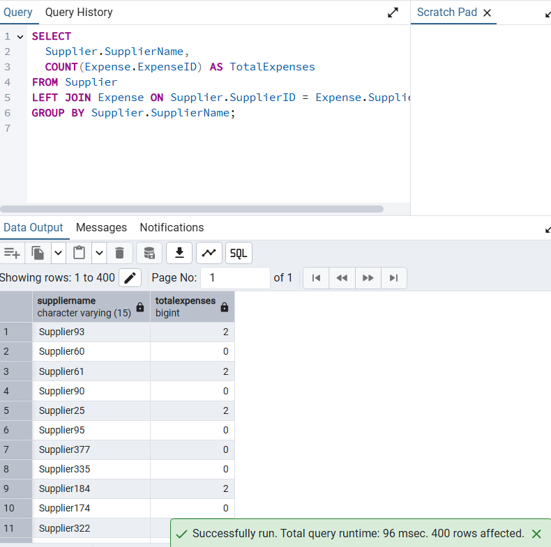
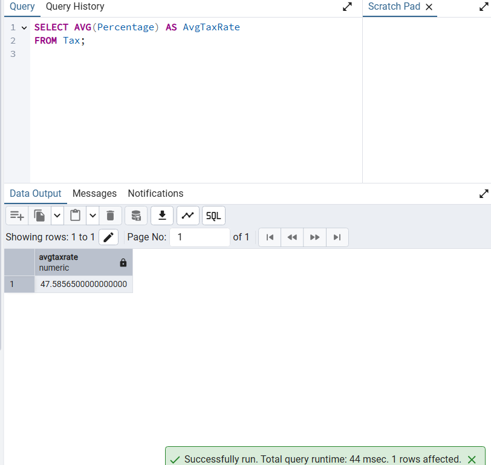

# 📝 Workshop Files & Scripts (Hanina Cohen & Oded Ofek) 🧓‍🎓

This workshop introduces key database concepts and provides hands-on practice in a controlled, containerized environment using PostgreSQL within Docker. Our project focuses on the financial part of a hotel management system, where we designed and implemented a database to track expenses, transactions, invoices, taxes, and payment methods. Below are the details of our implementation.

---

## 🎓 Team Members

* **Hanina Cohen** (ID: 337615041)
* **Oded Ofek** (ID: 215348145)

---

## 🔎 Key Concepts Covered

### Entity-Relationship Diagram (ERD)

* Designed an ERD to model relationships and entities for the financial part of a hotel management system.
* Focused on normalizing the database and ensuring scalability for tracking expenses, transactions, invoices, taxes, and payment methods.

**ERD Snapshot:**


### Data Structure Diagram (DSD) Snapshot


---

## 📊 ERD Explanation (Data Dictionary)

### Supplier

Represents a vendor or service provider from whom goods or services are purchased.

| Attribute      | Description                         | Data Type | Constraints |
| -------------- | ----------------------------------- | --------- | ----------- |
| SupplierID     | Unique identifier for each supplier | Integer   | Primary Key |
| SupplierName   | Legal name of the supplier          | Text      | Not Null    |
| ContactDetails | Phone, email, or other contact      | Text      |             |
| Address        | Physical or mailing address         | Text      |             |

### Expense

Represents a record of money spent related to business operations.

| Attribute     | Description                         | Data Type | Constraints            |
| ------------- | ----------------------------------- | --------- | ---------------------- |
| ExpenseID     | Unique identifier for each expense  | Integer   | Primary Key            |
| Description   | Details about the expense           | Text      |                        |
| Category      | Classification of expense           | Text      |                        |
| TransactionID | Reference to associated transaction | Integer   | Foreign Key (Not Null) |
| SupplierID    | Reference to the supplier           | Integer   | Foreign Key (Optional) |

### Transaction

Represents a financial event involving transfer of money.

| Attribute       | Description                       | Data Type | Constraints            |
| --------------- | --------------------------------- | --------- | ---------------------- |
| TransactionID   | Unique identifier for transaction | Integer   | Primary Key            |
| Date            | When the transaction occurred     | Date      | Not Null               |
| Amount          | Monetary value of transaction     | Decimal   | Not Null               |
| Status          | Current state of transaction      | Text      |                        |
| PaymentMethodID | Payment method used               | Integer   | Foreign Key (Not Null) |
| InvoiceID       | Reference to associated invoice   | Integer   | Foreign Key (Optional) |

### Invoice

Represents a formal document requesting payment.

| Attribute | Description                    | Data Type | Constraints |
| --------- | ------------------------------ | --------- | ----------- |
| InvoiceID | Unique identifier for invoice  | Integer   | Primary Key |
| Discount  | Discount offered by supplier   | Decimal   | Optional    |
| TypeAD    | Classification of invoice type | Text      |             |

### PaymentMethod

Represents the method by which a transaction was settled.

| Attribute       | Description                          | Data Type | Constraints |
| --------------- | ------------------------------------ | --------- | ----------- |
| PaymentMethodID | Unique identifier for payment method | Integer   | Primary Key |
| MethodName      | Name (e.g., Credit Card)             | Text      | Not Null    |
| MethodDetails   | Additional info if needed            | Text      |             |

### Tax

Information about taxation applied to a transaction.

| Attribute     | Description                      | Data Type | Constraints            |
| ------------- | -------------------------------- | --------- | ---------------------- |
| TaxID         | Unique identifier for tax record | Integer   | Primary Key            |
| TransactionID | Related transaction              | Integer   | Foreign Key (Not Null) |
| Percentage    | Tax rate applied                 | Decimal   |                        |
| TaxAmount     | Calculated tax amount            | Decimal   |                        |
| DoToDate      | Due date for payment/filing      | Date      |                        |

---

## 🛠️ Table Relationships with Notation

| Relationship Name | From (Entity) | To (Entity)     | Cardinality     | Description                                                                               |
| ----------------- | ------------- | --------------- | --------------- | ----------------------------------------------------------------------------------------- |
| `GetPaidBy`       | `Expense`     | `Supplier`      | `0..N` → `0..1` | A supplier may be linked to many expenses, and an expense may optionally have a supplier. |
| `Involves`        | `Expense`     | `Transaction`   | `1` → `1`       | Every expense must be linked to exactly one transaction.                                  |
| `GeneratedBy`     | `Transaction` | `Invoice`       | `0..1` ↔ `0..1` | A transaction may optionally generate one invoice and vice versa.                         |
| `Used`            | `Transaction` | `PaymentMethod` | `0..N` → `1`    | Each transaction uses exactly one payment method, which may be used by many transactions. |
| `Has`             | `Transaction` | `Tax`           | `0..1` ← `0..N` | A transaction can have many taxes; each tax belongs to exactly one transaction.           |

**Legend:**

* `1`: Exactly one (mandatory)
* `0..1`: Zero or one (optional)
* `0..N`: Zero or many (optional)
* `1..N`: One or many (at least one, mandatory)
* `↔`: Bidirectional

---

## 📁 Creating Tables

Translated the ERD into actual tables, defining columns, data types, primary keys, and foreign keys.
```sql
CREATE TABLE Supplier (
    SupplierID NUMERIC(5) NOT NULL,
    SupplierName VARCHAR(15) NOT NULL,
    ContactDetails VARCHAR(50) NOT NULL,
    Address VARCHAR(50) NOT NULL,
    PRIMARY KEY (SupplierID)
);

CREATE TABLE PaymentMethod (
    PaymentMethodID NUMERIC(5) NOT NULL,
    MethodName VARCHAR(15) NOT NULL,
    MethodDetails VARCHAR(50) NOT NULL,  -- Fixed typo from MehtodDetails
    PRIMARY KEY (PaymentMethodID)
);

CREATE TABLE Expense (
    ExpenseID NUMERIC(5) NOT NULL,
    Description VARCHAR(100) NOT NULL,
    Category VARCHAR(15) NOT NULL,
    SupplierID NUMERIC(5),  -- Can be NULL if expense doesn't have a supplier
    PRIMARY KEY (ExpenseID),
    FOREIGN KEY (SupplierID) REFERENCES Supplier(SupplierID)
);

CREATE TABLE Tax (
    TaxID NUMERIC(5) NOT NULL,
    Percentage NUMERIC(5,2) NOT NULL,  -- Changed to support decimals like 10.25%
    TaxAmount NUMERIC(10,2) NOT NULL,  -- Changed to NUMERIC for money values
    DueDate DATE NOT NULL,  -- Fixed typo from DoToDate
    PRIMARY KEY (TaxID)
);

CREATE TABLE Transaction (
    TransactionID NUMERIC(5) NOT NULL,
    Date DATE NOT NULL DEFAULT CURRENT_DATE,  -- Added DEFAULT for convenience
    Amount NUMERIC(10,2) NOT NULL CHECK (Amount > 0),  -- Added CHECK and changed to NUMERIC
    Status VARCHAR(15) NOT NULL DEFAULT 'Pending',  -- Added DEFAULT with common status
    ExpenseID NUMERIC(5),  -- Can be NULL if transaction isn't tied to a specific expense
    PRIMARY KEY (TransactionID),
    FOREIGN KEY (ExpenseID) REFERENCES Expense(ExpenseID)
);

CREATE TABLE Invoice (
    InvoiceID NUMERIC(5) NOT NULL,
    Discount NUMERIC(5,2),  -- Can be NULL if no discount
    Type CHAR(1) NOT NULL CHECK (Type IN ('A', 'D')),  -- Fixed column name from TypeA/D
    TransactionID NUMERIC(5) NOT NULL,
    PRIMARY KEY (InvoiceID),
    FOREIGN KEY (TransactionID) REFERENCES Transaction(TransactionID)
);

CREATE TABLE Used (
    TransactionID NUMERIC(5) NOT NULL,
    PaymentMethodID NUMERIC(5) NOT NULL,
    PRIMARY KEY (TransactionID, PaymentMethodID),
    FOREIGN KEY (TransactionID) REFERENCES Transaction(TransactionID),
    FOREIGN KEY (PaymentMethodID) REFERENCES PaymentMethod(PaymentMethodID)
);

CREATE TABLE Has (
    TaxID NUMERIC(5) NOT NULL,
    TransactionID NUMERIC(5) NOT NULL,
    PRIMARY KEY (TaxID, TransactionID),
    FOREIGN KEY (TaxID) REFERENCES Tax(TaxID),
    FOREIGN KEY (TransactionID) REFERENCES Transaction(TransactionID)
);
```

**Table Creation Snapshot:**


---

## 📝 Sample Data

Generated realistic sample data using SQL `INSERT` statements.

**Excel Snapshot:**


**CSV Snapshot:**


---

## 🔢 SQL Queries

Practiced writing queries to analyze financial data.

```sql
-- Query to get total expenses per supplier with tax details
SELECT
    s.SupplierName,
    SUM(e.Amount) AS TotalExpense,
    SUM(t.TaxAmount) AS TotalTax,
    t.Percentage
FROM Supplier s
JOIN Expense e ON s.SupplierID = e.SupplierID
JOIN Transaction tr ON e.TransactionID = tr.TransactionID
JOIN Tax t ON tr.TransactionID = t.TransactionID
GROUP BY s.SupplierName, t.Percentage
ORDER BY TotalExpense DESC;
```

---

## 📊 Stored Procedures and Functions

Created a stored procedure to calculate total tax for a given transaction.

```sql
CREATE OR REPLACE PROCEDURE CalculateTotalTaxForTransaction(p_TransactionID INTEGER)
LANGUAGE plpgsql
AS $$
DECLARE
    v_TotalTax DECIMAL;
BEGIN
    SELECT SUM(TaxAmount) INTO v_TotalTax
    FROM Tax
    WHERE TransactionID = p_TransactionID;

    RAISE NOTICE 'Total Tax for Transaction %: %', p_TransactionID, v_TotalTax;
END;
$$;

-- Call it:
CALL CalculateTotalTaxForTransaction(1);
```

---

## 🔍 Views

Created a view to simplify querying expense, supplier, and tax details.

```sql
CREATE VIEW ExpenseSummary AS
SELECT
    e.ExpenseID,
    e.Description,
    e.Category,
    s.SupplierName,
    tr.Amount,
    t.TaxAmount,
    t.Percentage
FROM Expense e
JOIN Supplier s ON e.SupplierID = s.SupplierID
JOIN Transaction tr ON e.TransactionID = tr.TransactionID
JOIN Tax t ON tr.TransactionID = t.TransactionID;

-- Query the view
SELECT * FROM ExpenseSummary;
```
## 📘 Stage B – Queries, Constraints, and Transactions

This stage focuses on querying the database, enforcing integrity constraints, and demonstrating transactional control. The work in this stage reflects the business logic needed for interacting with the financial subsystem of our hotel management system.

---

### 🔍 SQL Queries

We wrote complex SELECT, DELETE, and UPDATE queries that span multiple tables, utilize aggregate functions, joins, date logic, and grouping mechanisms.

All queries are numbered sequentially for clarity.

#### 🟢 Query 1 – Expenses with Suppliers and Transactions

```sql
SELECT 
  E.ExpenseID,
  E.Description,
  E.Category,
  S.SupplierName,
  T.Amount
FROM Expense E
JOIN Supplier S ON E.SupplierID = S.SupplierID
LEFT JOIN Transaction T ON E.ExpenseID = T.ExpenseID;
```

📸 Screenshot A – Result with columns from multiple tables


#### 🟢 Query 2 – Payment Methods Used in Transactions

```sql
SELECT 
  T.transactionid,
  T.date,
  PM.methodname,
  PM.methoddetails
FROM transaction T
JOIN "paymentMethodUsedInTransaction" U ON T.transactionid = U.transactionid
JOIN paymentmethod PM ON U.paymentmethodid = PM.paymentmethodid;
```

📸 Screenshot B – Results with detailed method names


#### 🟢 Query 3 – Total Spending per Supplier

```sql
SELECT 
  S.SupplierName,
  SUM(T.Amount) AS TotalSpent
FROM Supplier S
JOIN Expense E ON S.SupplierID = E.SupplierID
JOIN Transaction T ON E.ExpenseID = T.ExpenseID
GROUP BY S.SupplierName;
```

📸 Screenshot C – Aggregate spending by supplier


#### 🟢 Query 4 – Supplier Expense Counts

```sql
SELECT 
  Supplier.SupplierName,
  COUNT(Expense.ExpenseID) AS TotalExpenses
FROM Supplier
LEFT JOIN Expense ON Supplier.SupplierID = Expense.SupplierID
GROUP BY Supplier.SupplierName;
```

📸 Screenshot D – Number of expenses per supplier


#### 🟢 Query 5 – Transactions Without Taxes

```sql
SELECT T.transactionid
FROM transaction T
LEFT JOIN "transactionHasTax" H ON T.transactionid = H.transactionid
WHERE H.taxid IS NULL;
```

📸 Screenshot E – Transactions missing tax relationships


#### 🟢 Query 6 – Transaction Summary by Supplier, Category, and Payment Method

```sql
SELECT 
    T.TransactionID,
    T.Date,
    T.Amount,
    E.Category,
    S.SupplierName,
    PM.MethodName
FROM Transaction T
LEFT JOIN Expense E ON T.ExpenseID = E.ExpenseID
LEFT JOIN Supplier S ON E.SupplierID = S.SupplierID
LEFT JOIN "paymentMethodUsedInTransaction" U ON T.TransactionID = U.TransactionID
LEFT JOIN PaymentMethod PM ON U.PaymentMethodID = PM.PaymentMethodID;
```

📸 Screenshot F – Full context of each transaction


#### 🟢 Query 7 – Supplier with Highest Total Transaction Amount

```sql
SELECT SupplierName
FROM (
  SELECT 
    S.SupplierName,
    SUM(T.Amount) AS Total
  FROM Supplier S
  JOIN Expense E ON S.SupplierID = E.SupplierID
  JOIN Transaction T ON T.ExpenseID = E.ExpenseID
  GROUP BY S.SupplierName
  ORDER BY Total DESC
  LIMIT 1
) AS TopSupplier;
```

📸 Screenshot G – Top supplier only


#### 🟢 Query 8 – Invoices from the Last 30 Days

```sql
SELECT *
FROM Transaction
WHERE Date >= CURRENT_DATE - INTERVAL '30 days';
```

📸 Screenshot H – Recent transactions


#### 🟢 Query 9 – Final Invoice Amounts (after Discount)

```sql
SELECT 
  Invoice.InvoiceID,
  Transaction.Amount,
  Invoice.Discount,
  (Transaction.Amount - COALESCE(Invoice.Discount, 0)) AS FinalAmount
FROM Invoice
JOIN Transaction ON Invoice.TransactionID = Transaction.TransactionID;
```

📸 Screenshot I – Invoice totals with discount


#### 🟢 Query 10 – Transactions Above a Threshold

```sql
SELECT * 
FROM Transaction
WHERE Amount > 10000;
```

📸 Screenshot J – High value transactions


#### 🟢 Query 11 – Average Tax Rate

```sql
SELECT AVG(Percentage) AS AvgTaxRate
FROM Tax;
```

📸 Screenshot K – Mean percentage


#### 🟢 Query 12 – Tax Details Per Transaction

```sql
SELECT 
  T.transactionid,
  Tax.taxamount,
  Tax.percentage,
  Tax.duedate
FROM transaction T
JOIN "transactionHasTax" H ON T.transactionid = H.transactionid
JOIN tax ON H.taxid = Tax.taxid;
```

📸 Screenshot L – Taxes with amounts and deadlines


#### 🟢 Query 13 – Top 5 Suppliers by Transaction Count

```sql
SELECT 
  S.SupplierName,
  COUNT(T.TransactionID) AS TransactionCount
FROM Supplier S
JOIN Expense E ON S.SupplierID = E.SupplierID
JOIN Transaction T ON E.ExpenseID = T.ExpenseID
GROUP BY S.SupplierName
ORDER BY TransactionCount DESC
LIMIT 5;
```

📸 Screenshot M – Supplier rankings


---

### 🧹 DELETE Operations

#### Delete Old Transactions 

```sql
DELETE FROM transaction
WHERE date < '2025-06-20';
```

📸 Screenshot N – Before and after deletion


#### Delete Rejected Invoices 

```sql
DELETE FROM invoice
WHERE transactionid IN (
    SELECT transactionid
    FROM transaction
    WHERE status = 'Rejected'
);
```

📸 Screenshot O – Invoice table before and after


#### Delete Old Tax Links 

```sql
DELETE FROM "transactionHasTax"
WHERE transactionid IN (
    SELECT transactionid 
    FROM transaction 
    WHERE status = 'Completed' AND date < '2025-05-06'
);
```

📸 Screenshot P – Relationship cleanup


#### Delete Old Payment Links 

```sql
DELETE FROM "paymentMethodUsedInTransaction"
WHERE transactionid IN (
    SELECT transactionid 
    FROM transaction 
    WHERE status = 'Completed' AND date < '2025-05-06'
);
```

📸 Screenshot Q – Payment linkage cleaned


---

### ✏️ UPDATE Operations

#### Update Invoice Discounts 

```sql
UPDATE invoice
SET discount = 0.10
WHERE type = 'D';
```


#### Standardize Supplier Contact 
```sql
UPDATE supplier
SET contactdetails = CONCAT(suppliername, '@business.com')
WHERE contactdetails IS NULL 
OR contactdetails = '' 
OR contactdetails NOT LIKE '%@%'
OR contactdetails = 'supplier1@domain.com, 050-1234501';
```


#### Apply Late Fees 

```sql
UPDATE transaction
SET amount = amount * 1.05
WHERE date < CURRENT_DATE - INTERVAL '30 days'
AND status = 'Pending';
```


---

### ✅ Transaction Control

#### COMMIT Example 

```sql
BEGIN;
UPDATE transaction
SET status = 'Completed'
WHERE status = 'Pending';
COMMIT;
```

📸 Screenshot S – Final committed state


#### ROLLBACK Example (Query 22)

```sql
BEGIN;
UPDATE supplier 
SET contactdetails = 'updated@example.com, 050-1234501' 
WHERE contactdetails IS NULL OR contactdetails = 'supplier1@domain.com, 050-1234501';
-- Check state
SELECT * FROM supplier
WHERE contactdetails = 'updated@example.com, 050-1234501';
ROLLBACK;
```

📸 Screenshot T – Reverted update


---

### 📏 Constraints

#### Constraint 1 – NOT NULL on Transaction Amount

```sql
ALTER TABLE transaction
ALTER COLUMN amount SET NOT NULL;
```

#### Constraint 2 – DEFAULT on Payment Method Details

```sql
ALTER TABLE paymentmethod
ALTER COLUMN methoddetails SET DEFAULT 'USD';
```

#### Constraint 3 – DEFAULT on Transaction Status

```sql
ALTER TABLE transaction
ALTER COLUMN status SET DEFAULT 'Approved';
```


